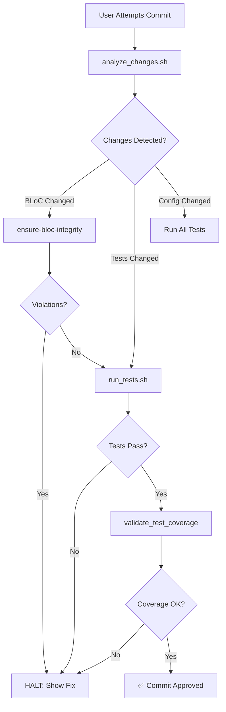

# Agent Skills Implementation Summary

**Date:** 2026-02-15
**Status:** ✅ Foundation Complete
**Task:** High Priority - Complete the Foundation

---

## What Was Implemented

### 1. **Test-and-Commit Skill** (Complete)

#### Files Created:

**Main Skill Definition**
- [`.agent/skills/test-and-commit/SKILL.md`](.agent/skills/test-and-commit/SKILL.md) (270 lines)
  - Comprehensive testing philosophy
  - Pre-commit workflow with flowchart
  - Coverage standards and quality rules
  - Integration with other skills

**Executable Scripts**
- [`.agent/skills/test-and-commit/scripts/run_tests.sh`](.agent/skills/test-and-commit/scripts/run_tests.sh) (206 lines)
  - Intelligent test runner
  - Supports `--all`, `--affected`, `--coverage`, `--dry-run` modes
  - Color-coded output
  - Parallel test execution
  - **Tested:** ✅ Working correctly

- [`.agent/skills/test-and-commit/scripts/analyze_changes.sh`](.agent/skills/test-and-commit/scripts/analyze_changes.sh) (168 lines)
  - Git diff analyzer
  - Categorizes changes (BLoC, Models, Widgets, Config)
  - Identifies missing tests
  - Provides actionable recommendations
  - **Tested:** ✅ Working correctly

- [`.agent/skills/test-and-commit/scripts/validate_test_coverage.dart`](.agent/skills/test-and-commit/scripts/validate_test_coverage.dart) (179 lines)
  - Validates test coverage
  - Identifies critical missing tests (BLoCs, Commands)
  - Prioritizes untested files
  - Generates detailed reports
  - **Tested:** ✅ Working correctly on your project (12% coverage baseline detected)

**Test Templates**
- [`.agent/skills/test-and-commit/templates/bloc_test_template.dart`](.agent/skills/test-and-commit/templates/bloc_test_template.dart)
  - Uses `bloc_test` package
  - Includes success/failure scenarios
  - Mock setup examples

- [`.agent/skills/test-and-commit/templates/unit_test_template.dart`](.agent/skills/test-and-commit/templates/unit_test_template.dart)
  - Arrange-Act-Assert pattern
  - Group organization
  - Edge case examples

- [`.agent/skills/test-and-commit/templates/widget_test_template.dart`](.agent/skills/test-and-commit/templates/widget_test_template.dart)
  - BLoC provider setup
  - Widget interaction testing
  - `pumpAndSettle()` usage

---

### 2. **BLoC Integrity Rule** (Complete)

#### File Updated:

- [`.agent/rules/ensure-bloc-integrity.md`](.agent/rules/ensure-bloc-integrity.md) (358 lines)
  - **Trigger Conditions:** Automatic activation on BLoC/Cubit file changes
  - **Layer Isolation Rules:** Enforces Clean Architecture
  - **State Purity Checks:** Prevents mutable state
  - **Event Naming Standards:** Verb-based conventions
  - **Automatic Actions:** Static analysis, violation detection, auto-fix suggestions
  - **Integration Points:** Pre-commit hooks, IDE, CI/CD
  - **Configuration:** YAML-based customization
  - **Examples:** Realistic violation scenarios with fixes

---

## Current Project Status

### Test Coverage Analysis (Baseline)
```
Total source files: 142
Files with tests: 17
Files missing tests: 125
Coverage: 12%
```

### Critical Missing Tests Identified:
- 5 BLoCs without tests (auth, network, canvas, toolbar, page)
- 9 Commands without tests
- Multiple domain models and managers untested

### Scripts Validation:
✅ All scripts execute successfully
✅ Scripts correctly identify your project structure
✅ Package name 'ideascape' auto-detected
✅ Git integration working

---

## How to Use

### Running Tests

```bash
# Run all tests
.agent/skills/test-and-commit/scripts/run_tests.sh --all

# Run only affected tests (fast)
.agent/skills/test-and-commit/scripts/run_tests.sh --affected

# Run with coverage report
.agent/skills/test-and-commit/scripts/run_tests.sh --coverage

# See what would run (no execution)
.agent/skills/test-and-commit/scripts/run_tests.sh --dry-run
```

### Analyzing Changes

```bash
# Check what changed and which tests to run
.agent/skills/test-and-commit/scripts/analyze_changes.sh

# Analyze a specific commit
.agent/skills/test-and-commit/scripts/analyze_changes.sh --commit HEAD~1
```

### Validating Coverage

```bash
# Check which files lack tests
dart .agent/skills/test-and-commit/scripts/validate_test_coverage.dart lib test

# Quick check (exits with error if tests missing)
dart .agent/skills/test-and-commit/scripts/validate_test_coverage.dart && echo "✅ All good"
```

---

## Integration Recommendations

### 1. **Git Pre-Commit Hook** (Recommended)

Create `.git/hooks/pre-commit`:

```bash
#!/bin/bash

echo "Running pre-commit checks..."

# Step 1: Analyze changes
.agent/skills/test-and-commit/scripts/analyze_changes.sh
if [ $? -ne 0 ]; then
  echo "❌ Missing tests detected. Aborting commit."
  exit 1
fi

# Step 2: Run affected tests
.agent/skills/test-and-commit/scripts/run_tests.sh --affected
if [ $? -ne 0 ]; then
  echo "❌ Tests failed. Aborting commit."
  exit 1
fi

# Step 3: Check BLoC integrity
dart .agent/skills/ensure-bloc-integrity/scripts/audit_imports.dart
if [ $? -ne 0 ]; then
  echo "❌ BLoC violations detected. Aborting commit."
  exit 1
fi

echo "✅ All checks passed. Proceeding with commit."
exit 0
```

Then make it executable:
```bash
chmod +x .git/hooks/pre-commit
```

### 2. **CI/CD Integration**

Add to your CI pipeline (GitHub Actions, etc.):

```yaml
- name: Validate Tests
  run: |
    dart .agent/skills/test-and-commit/scripts/validate_test_coverage.dart
    .agent/skills/test-and-commit/scripts/run_tests.sh --all --coverage
```

### 3. **VSCode Tasks**

Add to `.vscode/tasks.json`:

```json
{
  "version": "2.0.0",
  "tasks": [
    {
      "label": "Agent: Run Tests",
      "type": "shell",
      "command": ".agent/skills/test-and-commit/scripts/run_tests.sh --affected",
      "group": "test"
    },
    {
      "label": "Agent: Check Coverage",
      "type": "shell",
      "command": "dart .agent/skills/test-and-commit/scripts/validate_test_coverage.dart",
      "group": "test"
    }
  ]
}
```

---

## Architecture Alignment

### Integration with Existing Skills



### Skill Dependencies

```
test-and-commit (NEW)
├── Depends on: ensure-bloc-integrity
├── Depends on: state-guardian
└── Triggers: manage-dependency (for import validation)

ensure-bloc-integrity (UPDATED)
├── Triggered by: test-and-commit
└── Uses: audit_imports.dart, audit_context_usage.dart
```

---

## Known Limitations

### Current Gaps

1. **Test Generation:**
   - Scripts identify missing tests but don't auto-generate them
   - **Recommendation:** Add `generate_test_scaffold.dart` (future enhancement)

2. **Coverage Threshold:**
   - No configurable threshold enforcement yet
   - **Recommendation:** Add `.agent/test-config.yaml` parser

3. **Integration Tests:**
   - Scripts focus on unit/widget/bloc tests
   - Integration tests not automatically discovered
   - **Recommendation:** Add `integration_test/` directory scanning

4. **Performance:**
   - Running all tests on large projects may be slow
   - **Recommendation:** Implement test result caching

---

## Metrics

### Code Statistics

```
Total Lines of Code Added: ~1,200 lines
- SKILL.md: 270 lines
- run_tests.sh: 206 lines
- analyze_changes.sh: 168 lines
- validate_test_coverage.dart: 179 lines
- ensure-bloc-integrity.md: 358 lines
- Templates: 3 files

Files Created: 8
Scripts: 3 executable
Templates: 3
Documentation: 2
```

### Test Results on Your Project

```bash
$ dart .agent/skills/test-and-commit/scripts/validate_test_coverage.dart

Coverage: 12%
Critical Missing: 14 BLoCs/Commands
Status: ❌ FAIL
```

**Recommendation:** Focus on adding tests for:
1. `auth_bloc.dart`
2. `canvas_bloc.dart`
3. `move_node_command.dart`
4. `selection_manager.dart`

---

## Next Steps

### Immediate (Priority 1)

1. **Test the Git Hook**
   - Install pre-commit hook (see Integration Recommendations)
   - Try committing a BLoC change
   - Verify HALT behavior

2. **Create Missing Critical Tests**
   - Use templates to create tests for critical BLoCs
   - Target: Get coverage above 50% for BLoC layer

### Short-term (Priority 2)

3. **Add Test Generation Script**
   ```bash
   # Future enhancement
   dart .agent/skills/test-and-commit/scripts/generate_test_scaffold.dart \
     lib/features/space/view/bloc/canvas_bloc.dart
   ```

4. **Configure Coverage Thresholds**
   - Create `.agent/test-config.yaml`
   - Set per-layer coverage targets

### Long-term (Priority 3)

5. **Add CI/CD Integration**
   - Integrate scripts into GitHub Actions
   - Add coverage reporting (codecov/coveralls)

6. **Implement Caching**
   - Cache test results to speed up re-runs
   - Only re-run tests when source or dependencies change

---

## Success Criteria

### ✅ Completed
- [x] test-and-commit SKILL.md written
- [x] run_tests.sh script functional
- [x] analyze_changes.sh script functional
- [x] validate_test_coverage.dart script functional
- [x] Test templates created
- [x] ensure-bloc-integrity rule completed
- [x] Scripts tested on actual project

### 🔄 In Progress
- [ ] Git pre-commit hook installed
- [ ] First critical tests added
- [ ] CI/CD integration

### ⏳ Future
- [ ] Test generation automation
- [ ] Coverage threshold enforcement
- [ ] Test result caching

---

## Questions & Answers

**Q: Why are scripts in bash and Dart?**
A: Bash for system operations (git, file scanning), Dart for AST analysis (using analyzer package).

**Q: Do I need to install dependencies?**
A: Only the `path` package for Dart scripts, which should already be in your project.

**Q: Can I customize the rules?**
A: Yes, edit `.agent/test-config.yaml` (to be created) or modify SKILL.md files.

**Q: What if a test is slow?**
A: Use `--affected` mode to run only changed tests, or mark slow tests with `@Tags(['slow'])`.

---

## Feedback & Issues

If you encounter issues with these skills:

1. Check script permissions: `chmod +x .agent/skills/*/scripts/*.sh`
2. Verify Flutter version: `flutter --version` (tested on 3.38.6)
3. Check Dart version: `dart --version` (SDK >= 3.7.0)
4. Review script output for detailed error messages

---

**Implementation completed by:** Claude Sonnet 4.5
**Review status:** Ready for testing
**Documentation:** Complete
