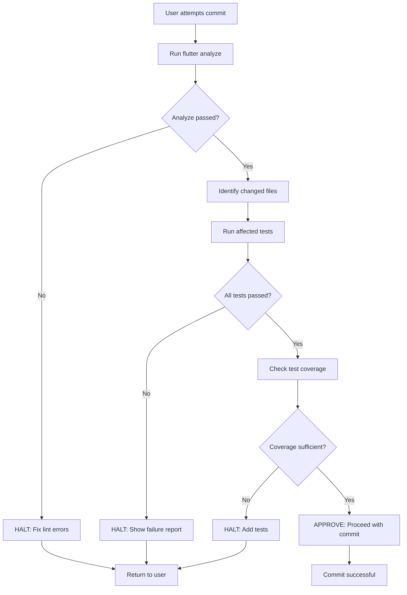

# **Test and Commit Skill**

## **Objective**

Ensure all code changes are verified through comprehensive testing before committing. Maintain high test coverage and enforce Flutter/Dart testing best practices.

## **Philosophy**

**"No Commit Without Tests"** - Every functional change must have corresponding test coverage. This skill acts as a gatekeeper, preventing untested code from entering the repository.

## **Testing Hierarchy**

1. **Unit Tests** (Fastest) - Pure Dart logic, no Flutter dependencies
2. **BLoC Tests** (Fast) - State management verification using `bloc_test`
3. **Widget Tests** (Medium) - UI component testing with `WidgetTester`
4. **Integration Tests** (Slowest) - Full feature flows (only when necessary)

## **Reasoning Protocol**

### **Phase 1: Discovery**
1. Execute `scripts/analyze_changes.sh` to identify modified files
2. Determine which tests are affected by the changes
3. Check if new files require new tests

### **Phase 2: Test Execution**
1. Run affected unit tests: `flutter test test/path/to/specific_test.dart`
2. Run BLoC tests if state management changed
3. Run widget tests if UI components changed
4. Generate coverage report if requested

### **Phase 3: Validation**
1. Verify all tests pass (exit code 0)
2. Check coverage meets minimum threshold (if configured)
3. Validate test quality (no skipped tests, no empty test blocks)

### **Phase 4: Commit Approval**
1. If all tests pass → APPROVE for commit
2. If tests fail → HALT and provide failure analysis
3. If new code lacks tests → HALT and suggest test structure

## **Constraints**

### **Hard Rules**
* **NEVER** commit if any test fails
* **NEVER** skip tests with `flutter test --skip` without explicit user permission
* **NEVER** commit new BLoC/Cubit without corresponding `bloc_test`
* **ALWAYS** run `flutter analyze` before test execution to catch static errors

### **Coverage Standards**
* New BLoC classes: **100% coverage required**
* New domain models: **90% coverage required**
* New UI widgets: **80% coverage required**
* Utility functions: **100% coverage required**

### **Test Quality Rules**
* BLoC tests MUST use `bloc_test` package (not manual stream listening)
* Widget tests MUST use `pumpAndSettle()` for animations
* Mock all external dependencies (repositories, APIs, platform channels)
* No hardcoded delays (`await Future.delayed`) - use fake async

## **Tools**

### **scripts/run_tests.sh**
Intelligently runs tests based on changed files.

**Usage:**
```bash
# Run all tests
./scripts/run_tests.sh --all

# Run only affected tests (fast mode)
./scripts/run_tests.sh --affected

# Run with coverage
./scripts/run_tests.sh --coverage

# Dry run (show what would be tested)
./scripts/run_tests.sh --dry-run
```

### **scripts/analyze_changes.sh**
Analyzes git diff to determine which files changed and which tests to run.

**Usage:**
```bash
# Analyze staged changes
./scripts/analyze_changes.sh

# Analyze changes in a specific commit
./scripts/analyze_changes.sh --commit HEAD~1
```

### **scripts/validate_test_coverage.dart**
Validates that new/modified files have corresponding tests.

**Usage:**
```bash
dart scripts/validate_test_coverage.dart
```

## **Pre-Commit Workflow**



## **Error Handling**

### **When Tests Fail**
1. **Analyze the failure**: Categorize as logic error, mock issue, or timing issue
2. **Provide context**: Show the failing test output with file:line references
3. **Suggest fixes**: Based on common patterns (e.g., "Did you forget to await?")
4. **DO NOT auto-fix**: Tests failing usually indicate real bugs

### **When Coverage is Low**
1. **Identify untested code**: Use `lcov` output to find untested lines
2. **Generate test scaffold**: Create test file structure for user to fill
3. **Explain why**: "Method `calculateBounds()` has complex logic and needs verification"

### **When Tests Are Missing**
1. **HALT immediately**: Before running any tests
2. **Show template**: Provide appropriate test template (unit/bloc/widget)
3. **Explain requirements**: "New BLoC requires testing all events and states"

## **Integration with Other Skills**

### **Depends On:**
- `ensure-bloc-integrity`: Validates BLoC architecture before testing
- `state-guardian`: Ensures state immutability (prevents test flakiness)

### **Triggers:**
- Automatically runs before any git commit (via git hook)
- Can be invoked manually via `/test` command
- Runs in CI/CD pipeline

## **Performance Optimization**

### **Parallel Test Execution**
```bash
# Run tests in parallel (faster CI)
flutter test --concurrency=4
```

### **Cached Test Results**
- Store test results in `.test_cache/`
- Only re-run tests if source or test file changed
- Cache invalidation on dependency changes

## **Examples**

### **Example 1: New BLoC Added**
```
User: Adds `canvas_zoom_bloc.dart`
Agent:
  1. Runs analyze_changes.sh → Detects new BLoC
  2. HALT: "New BLoC detected. Creating test template..."
  3. Generates test/features/canvas/bloc/canvas_zoom_bloc_test.dart
  4. Shows template with TODO markers
  5. Waits for user to implement tests
```

### **Example 2: Test Failure**
```
User: Attempts commit after modifying `selection_manager.dart`
Agent:
  1. Runs affected tests: `selection_manager_test.dart`
  2. Test fails: "Expected 2 selected items, got 3"
  3. HALT: Shows failure with context:
     - File: test/...selection_manager_test.dart:45
     - Likely cause: "selectAll() might not be filtering correctly"
  4. Suggests: "Check if non-selectable items are being included"
```

### **Example 3: All Tests Pass**
```
User: Attempts commit after fixing a bug
Agent:
  1. Runs flutter analyze → ✓ No issues
  2. Runs affected tests → ✓ All 12 tests passed
  3. Checks coverage → ✓ Modified lines are covered
  4. APPROVE: "All validations passed. Proceeding with commit."
```

## **Configuration**

Create `.agent/test-config.yaml` for project-specific settings:

```yaml
# Test and Commit Configuration
coverage:
  enabled: true
  minimum_coverage: 80
  strict_mode: false  # If true, fails on any coverage drop

test_patterns:
  unit_test_suffix: "_test.dart"
  integration_test_dir: "integration_test/"

exclude_from_coverage:
  - "**/*.g.dart"  # Generated files
  - "**/*.freezed.dart"
  - "**/main.dart"

parallel_execution:
  enabled: true
  max_workers: 4

pre_commit:
  run_analyze: true
  run_tests: true
  check_coverage: false  # Too slow for commits
```

## **Resources**

### **templates/unit_test_template.dart**
Basic unit test structure for pure Dart classes.

### **templates/bloc_test_template.dart**
Template using `bloc_test` package with proper setup/teardown.

### **templates/widget_test_template.dart**
Widget test with `WidgetTester` and pump/settle patterns.

## **Maintenance**

### **Self-Verification**
The skill can test itself:
```bash
# Verify test scripts work
dart .agent/skills/test-and-commit/scripts/validate_test_coverage.dart
```

### **Updating Test Standards**
When Flutter/Dart best practices change:
1. Update this SKILL.md
2. Update test templates
3. Run migration script to update existing tests (if needed)

## **Success Metrics**

Track these to measure skill effectiveness:
- **Test Pass Rate**: Should be >95% (before commit attempts)
- **Coverage Trend**: Should increase or stay stable
- **False HALT Rate**: How often the skill blocks valid commits (<5%)
- **Commit Revert Rate**: How often commits are reverted due to bugs (should decrease)
