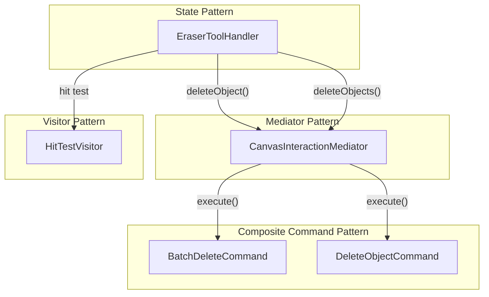

# Eraser Tool Implementation Plan

Implement tap-to-delete and drag-to-erase functionality with full undo/redo support using 4 design patterns.

## Design Patterns Overview



## Design Patterns Used

| Pattern | Purpose | File |
|---------|---------|------|
| **Composite Command** | Batch undo for drag-erase | `batch_delete_command.dart` |
| **Mediator** | Centralized delete logic | `interaction_mediator.dart` |
| **Visitor** | Accurate hit-testing | `HitTestVisitor` |
| **State/Strategy** | Tool-specific behavior | `eraser_tool_handler.dart` |

## Files

### New Files
- `lib/features/space/view/utils/canvas_utils.dart` - Shared utility for coordinate transformation
- `lib/features/space/domain/commands/batch_delete_command.dart` - Composite Command for batch deletion

### Modified Files
- `lib/features/space/domain/interaction_mediator.dart` - Added `deleteObject()` and `deleteObjects()`
- `lib/features/space/view/pages/tool_handler/implementations/eraser_tool_handler.dart` - Full implementation
- `lib/features/space/view/pages/tool_handler/implementations/shape_tool_handler.dart` - Refactored to use `CanvasUtils`
- `lib/features/space/view/pages/tool_handler/tool_handler_factory.dart` - Non-const eraser handler

## Implementation Details

### BatchDeleteCommand (Composite Command Pattern)

```dart
class BatchDeleteCommand implements SpaceCommand {
  final List<SpaceObject> objects;

  BatchDeleteCommand(this.objects);

  @override
  Future<void> execute(ShapeLayerBloc bloc) async {
    for (final obj in objects) {
      bloc.add(ShapeLayerEvent.removeObject(obj.id));
    }
  }

  @override
  Future<void> undo(ShapeLayerBloc bloc) async {
    for (final obj in objects) {
      bloc.add(ShapeLayerEvent.addObject(obj));
    }
  }
}
```

### CanvasUtils (Utility Class)

```dart
class CanvasUtils {
  CanvasUtils._();

  static Offset toWorldPoint(Offset local, TransformationController controller) {
    return MatrixUtils.transformPoint(
      Matrix4.inverted(controller.value),
      local,
    );
  }
}
```

### Mediator Delete Methods

```dart
void deleteObject(SpaceObject object) {
  history.execute(DeleteObjectCommand(object));
}

void deleteObjects(List<SpaceObject> objects) {
  if (objects.isEmpty) return;
  if (objects.length == 1) {
    deleteObject(objects.first);
  } else {
    history.execute(BatchDeleteCommand(objects));
  }
}
```

## How It Works

### Tap to Delete
1. User taps on an object
2. `HitTestVisitor` finds the object under cursor
3. `mediator.deleteObject()` executes `DeleteObjectCommand`
4. Object removed, recorded in history

### Drag to Erase
1. User drags across canvas
2. Each touched object is immediately hidden (visual feedback)
3. On drag end, `BatchDeleteCommand` is executed
4. `Cmd+Z` restores ALL erased objects at once

## Testing

1. Run `flutter run -d chrome`
2. Create several shapes on the canvas
3. Select the **Eraser tool**
4. **Test tap**: Click on a shape → shape is deleted
5. **Test drag**: Drag across multiple shapes → all touched shapes are deleted
6. **Test undo**: Press `Cmd+Z` → all shapes from last drag are restored together
7. **Test redo**: Press `Cmd+Shift+Z` → shapes are deleted again
