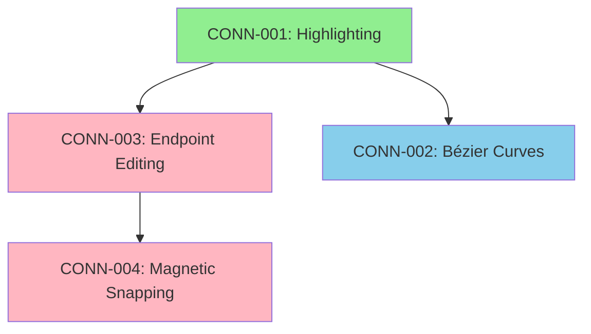

# Connector Enhancements Roadmap

**Initiative:** Connector System Improvements
**Created:** 2026-02-16
**Status:** Planning Phase
**Total Effort:** ~4-5 weeks for all epics

---

## Overview

This roadmap outlines a comprehensive enhancement of the connector system in unidea-space. The goal is to transform connectors from simple straight lines into a powerful, user-friendly connection system that rivals professional diagramming tools like Miro, Figma, and Lucidchart.

---

## Epic Summary

| Epic ID | Name | Priority | Effort | Dependencies | Impact |
|---------|------|----------|--------|--------------|--------|
| [CONN-001](epic-connector-highlighting.md) | Enhanced Connector Highlighting | High | Medium (5-6 days) | None | UX, Visibility |
| [CONN-002](epic-connector-bezier-curves.md) | Cubic Bézier Curves | Medium | High (12-15 days) | CONN-001 | Visual Quality |
| [CONN-003](epic-connector-endpoint-editing.md) | Dynamic Endpoint Editing | High | Medium (8-10 days) | CONN-001, Command Pattern | Flexibility |
| [CONN-004](epic-connector-magnetic-snapping.md) | Magnetic Connector Creation | High | Medium (8-10 days) | CONN-003 | Usability |

**Total Estimated Effort:** 33-41 days (4.5-5.5 weeks for one developer)

---

## Phased Implementation Strategy

### Phase 1: Foundation (Week 1-2)
**Goal:** Improve basic connector visibility and interaction

#### CONN-001: Enhanced Connector Highlighting
- **Duration:** 5-6 days
- **Why First:**
  - No dependencies
  - Provides immediate UX improvement
  - Foundation for other epics (handle visualization)
- **Deliverables:**
  - Hover highlighting
  - Selection states
  - Handle visualization
  - Better hit testing

**Key Results:**
- ✅ Connectors are easier to see and interact with
- ✅ Clear visual feedback for all states
- ✅ Foundation for endpoint manipulation

---

### Phase 2: Restructuring (Week 2-3)
**Goal:** Enable flexible diagram restructuring

#### CONN-003: Dynamic Endpoint Editing
- **Duration:** 8-10 days
- **Why Second:**
  - Builds on CONN-001 (uses handle system)
  - Critical for user workflow
  - Enables diagram restructuring
- **Deliverables:**
  - Object-based connector endpoints
  - Attachment point system
  - Drag-to-reconnect functionality
  - Auto-update when objects move

**Key Results:**
- ✅ Users can reconnect existing connectors
- ✅ Connectors follow objects when moved
- ✅ No need to delete and recreate connectors

---

### Phase 3: Creation UX (Week 3-4)
**Goal:** Make connector creation effortless

#### CONN-004: Magnetic Connector Creation
- **Duration:** 8-10 days
- **Why Third:**
  - Builds on CONN-003 (uses attachment points)
  - Dramatically improves creation UX
  - Complements endpoint editing
- **Deliverables:**
  - Magnetic snap detection
  - Visual preview system
  - Smart attachment point selection
  - Keyboard modifiers (Shift to disable)

**Key Results:**
- ✅ Users can create connectors without pixel-perfect precision
- ✅ Connector creation time reduced by 40%
- ✅ 95%+ success rate on first attempt

---

### Phase 4: Visual Polish (Week 4-5)
**Goal:** Professional-looking curved connections

#### CONN-002: Cubic Bézier Curves
- **Duration:** 12-15 days
- **Why Last:**
  - Most complex implementation
  - Benefits from completed foundation
  - Can be implemented independently
- **Deliverables:**
  - Cubic Bézier curve rendering
  - Control point manipulation
  - Smart curve generation
  - Curved hit testing

**Key Results:**
- ✅ Diagrams look professional and polished
- ✅ Curves route more naturally
- ✅ Visual variety in diagrams

---

## Alternative Sequencing

### Option A: Quick Wins First (Recommended)
```
CONN-001 (5-6 days)
  ↓
CONN-003 (8-10 days)
  ↓
CONN-004 (8-10 days)
  ↓
CONN-002 (12-15 days)
```
**Pros:** Fastest time to user value, builds incrementally
**Cons:** Curves come last

### Option B: Visual Impact First
```
CONN-001 (5-6 days)
  ↓
CONN-002 (12-15 days)
  ↓
CONN-003 (8-10 days)
  ↓
CONN-004 (8-10 days)
```
**Pros:** Big visual impact early
**Cons:** Curved connectors without flexible endpoints

### Option C: Parallel Development (if 2+ developers)
```
Developer 1: CONN-001 → CONN-003 → CONN-004
Developer 2: Wait → CONN-002 (start after CONN-001)
```
**Pros:** Faster completion (3-4 weeks instead of 5)
**Cons:** Requires coordination, potential merge conflicts

---

## Dependencies Diagram



**Legend:**
- 🟢 Green = Foundation (no dependencies)
- 🔴 Pink = High Priority
- 🔵 Blue = Medium Priority

---

## MVP vs Full Implementation

### Minimum Viable Product (MVP) - 2 weeks
For a quick release, implement:
1. **CONN-001**: Highlighting (5-6 days)
2. **CONN-004**: Magnetic Snapping (basic version, 5-6 days)

**Result:** Significantly improved connector UX without major architectural changes

### Full Implementation - 5 weeks
All four epics for a complete, professional-grade connector system.

---

## Risk Assessment

| Risk | Probability | Impact | Mitigation |
|------|-------------|--------|------------|
| Bézier hit testing performance | Medium | High | Implement spatial indexing, optimize sampling |
| Attachment point conflicts | Low | Medium | Well-tested attachment algorithm |
| Backward compatibility issues | Medium | High | Migration scripts, thorough testing |
| Scope creep | High | Medium | Strict epic boundaries, defer enhancements |
| User learning curve | Low | Medium | Tooltips, onboarding, documentation |

---

## Success Criteria

### Quantitative Metrics
- ✅ Connector creation time: -40%
- ✅ Connector selection accuracy: +30%
- ✅ Diagram restructuring time: -50%
- ✅ User satisfaction score: >4.5/5
- ✅ Feature adoption rate: >70% of users

### Qualitative Goals
- Users describe connectors as "easy to use"
- Reduced support requests about connector issues
- Positive social media feedback
- Competitive parity with Miro/Figma

---

## Testing Strategy

### Per-Epic Testing
Each epic includes:
- Unit tests (utilities, algorithms)
- Widget tests (UI components)
- Integration tests (full workflows)
- Manual testing checklist

### End-to-End Testing
After all epics:
1. **Smoke Tests**: Basic connector workflows
2. **Regression Tests**: Ensure old functionality intact
3. **Performance Tests**: 100+ connectors on canvas
4. **Cross-platform Tests**: Web, desktop, mobile
5. **User Acceptance Tests**: Beta users validate

---

## Rollout Plan

### Beta Release (Week 5)
- Enable features behind feature flag
- Invite 50-100 beta users
- Collect feedback via surveys
- Monitor crash reports and bugs

### Staged Rollout (Week 6)
- 10% of users (Day 1)
- 50% of users (Day 3)
- 100% of users (Day 7)
- Monitor metrics at each stage

### Rollback Plan
- Feature flags allow instant disable
- Database rollback scripts prepared
- Communication plan for users

---

## Future Enhancements (Post-Roadmap)

After completing all four epics, consider:

### Short-term (Next Sprint)
1. **Connector Styles**: Dashed, dotted, arrows
2. **Color Presets**: Quick-select connector colors
3. **Keyboard Shortcuts**: Hotkeys for connector tool
4. **Undo/Redo Polish**: Smooth undo for all operations

### Medium-term (Next Quarter)
1. **Orthogonal Connectors**: Right-angle connections
2. **Multi-segment Curves**: Complex path routing
3. **Connector Labels**: Text on connectors
4. **Smart Routing**: Auto-avoid obstacles

### Long-term (Future Releases)
1. **3D Connectors**: Perspective connections
2. **Animated Connectors**: Flow animations
3. **Connector Groups**: Bundle multiple connectors
4. **AI-powered Layout**: Auto-organize diagrams

---

## Resource Requirements

### Development Team
- **Option 1 (Sequential):** 1 senior developer, 5 weeks
- **Option 2 (Parallel):** 2 developers, 3-4 weeks
- **Option 3 (MVP):** 1 developer, 2 weeks

### Design Support
- ~5-10 hours for visual design feedback
- UX review of magnetic snapping behavior
- Interaction design for Bézier control points

### QA Support
- ~20 hours per epic for testing
- Regression testing after all epics
- Performance testing with large diagrams

---

## Budget Estimate

| Item | Cost (USD) | Notes |
|------|-----------|-------|
| Development (200h @ $100/h) | $20,000 | Senior developer, 5 weeks |
| Design (10h @ $80/h) | $800 | UX/UI consultation |
| QA (80h @ $60/h) | $4,800 | Testing all epics |
| **Total** | **$25,600** | Full implementation |

**MVP Option:** ~$10,000 (2 weeks dev + testing)

---

## Communication Plan

### Internal Updates
- Weekly status updates to stakeholders
- Demo videos at end of each epic
- Technical blog posts for each pattern used

### External Updates
- Changelog entries for each release
- Social media announcements
- Tutorial videos/documentation
- Beta user outreach

---

## Measuring Success

### Week 1 Post-Launch
- Monitor crash rates
- Track feature usage analytics
- Collect user feedback
- Fix critical bugs

### Month 1 Post-Launch
- Analyze usage metrics vs goals
- Conduct user interviews
- Identify pain points
- Plan iteration cycle

### Quarter 1 Post-Launch
- Measure ROI (development cost vs user value)
- Assess competitive positioning
- Plan next phase of enhancements
- Consider open-sourcing connector system

---

## Appendix: Technical Patterns Used

### Design Patterns
1. **Visitor Pattern**: Node operations (already in use)
2. **Strategy Pattern**: Attachment point algorithms
3. **Observer Pattern**: Connector updates on object move
4. **Command Pattern**: Undo/redo support
5. **Factory Pattern**: Snap target creation
6. **Chain of Responsibility**: Gesture handling (already in use)

### Flutter Patterns
1. **BLoC Pattern**: State management
2. **CustomPainter**: Canvas rendering
3. **GestureDetector**: User interactions
4. **AnimatedBuilder**: Smooth transitions

---

## Related Documentation

- [Tool Handler Architecture Refactoring](tool-handler-architecture-refactoring.md)
- [Chain of Responsibility Pattern](../lib/features/space/view/pages/tool_handler/CHAIN_OF_RESPONSIBILITY_PATTERN.md)
- [Command Pattern Refactoring](../../tracker/REFACTOR-COMMAND-PATTERN.md)
- [Flutter Multiplayer Architecture](../sync/Flutter%20Multiplayer%20Architecture%20(v2).md)

---

## Questions & Decisions Log

### Q1: Should connectors auto-delete when attached objects are deleted?
**Decision:** Yes (Option A)
**Rationale:** Prevents orphaned connectors, cleaner diagrams
**Date:** 2026-02-16

### Q2: Should we support circular connectors (object to itself)?
**Decision:** Yes, with different attachment points
**Rationale:** Useful for state diagrams, flowcharts
**Date:** 2026-02-16

### Q3: Default connector type: straight or curved?
**Decision:** Defer to user preference setting
**Rationale:** Different use cases prefer different defaults
**Date:** 2026-02-16

### Q4: Should attachment points be customizable?
**Decision:** Not in initial release, add later
**Rationale:** 9 fixed points sufficient for MVP
**Date:** 2026-02-16

---

## Approval & Sign-off

| Role | Name | Signature | Date |
|------|------|-----------|------|
| Product Owner | TBD | | |
| Tech Lead | TBD | | |
| UX Designer | TBD | | |
| QA Lead | TBD | | |

---

**Last Updated:** 2026-02-16
**Next Review:** 2026-02-23 (weekly)
**Status:** ✅ Ready for Implementation
