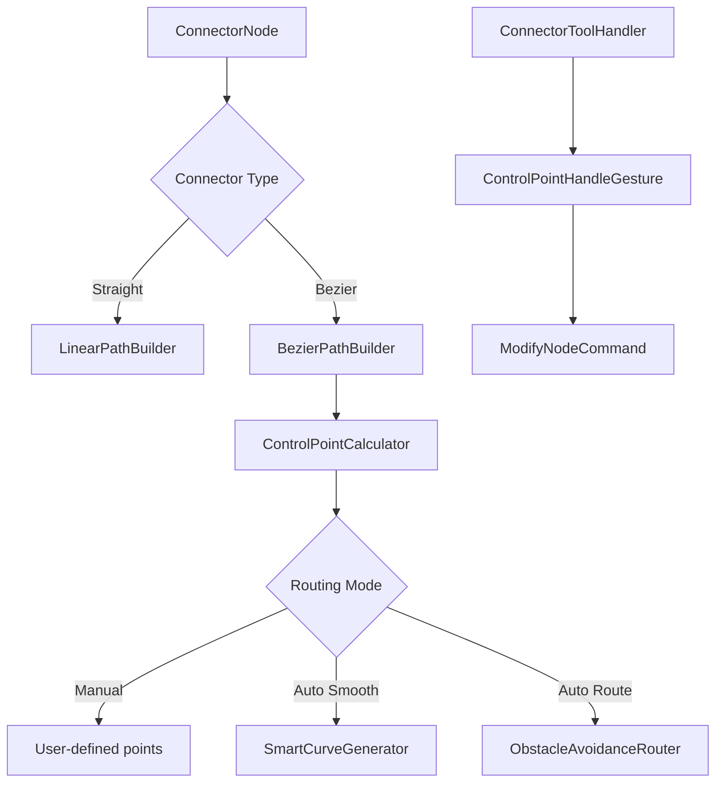

# Epic: Cubic Bézier Curves for Connectors

**Epic ID:** CONN-002
**Priority:** Medium
**Effort:** High
**Status:** Not Started
**Created:** 2026-02-16

---

## Executive Summary

Add support for cubic Bézier curves to connectors, allowing smooth curved connections between objects instead of straight lines. This provides more visually appealing diagrams and better routing around obstacles.

---

## Problem Statement

Current connector implementation:
- Only supports straight lines between objects
- Connectors overlap with objects when nodes are close
- No way to route around obstacles
- Limited visual variety in diagrams
- Difficult to distinguish multiple connectors between same objects

---

## Goals

1. **Curved Connectors**: Support smooth cubic Bézier curves
2. **Flexible Control**: User can adjust curve control points
3. **Smart Routing**: Auto-generate curves that avoid obstacles
4. **Visual Polish**: Professional-looking curved connections
5. **Backward Compatibility**: Existing straight connectors still work

---

## User Stories

### US-1: As a user, I want connectors to be curved instead of straight
**Acceptance Criteria:**
- New connectors default to smooth curves
- Curve automatically adjusts based on start/end positions
- Curve direction follows object orientation
- User can toggle between straight and curved modes

### US-2: As a user, I want to adjust curve control points
**Acceptance Criteria:**
- Control points are visible when connector is selected
- User can drag control points to reshape curve
- Control points snap to guides (optional)
- Changes are undoable/redoable

### US-3: As a user, I want smart curve routing
**Acceptance Criteria:**
- Curves automatically route around intersecting objects
- Multiple connectors between same objects take different paths
- Curves maintain smooth S-curve or C-curve shape
- Auto-routing can be disabled for manual control

---

## Technical Approach

### Data Model Changes

#### Update ConnectorNode
**File:** `lib/features/space/domain/models/objects/node.dart`

```dart
@freezed
class ConnectorNode with _$ConnectorNode implements Node {
  const factory ConnectorNode({
    required String id,
    required Offset startPoint,
    required Offset endPoint,
    @Default(0xFF000000) int color,
    @Default(2.0) double strokeWidth,

    // NEW: Bézier curve support
    @Default(ConnectorType.straight) ConnectorType type,
    Offset? controlPoint1, // First control point (for cubic Bézier)
    Offset? controlPoint2, // Second control point (for cubic Bézier)
    @Default(ConnectorRoutingMode.manual) ConnectorRoutingMode routingMode,
  }) = _ConnectorNode;
}

enum ConnectorType {
  straight,      // Classic line
  bezier,        // Cubic Bézier curve
  orthogonal,    // Right-angle connections (future)
}

enum ConnectorRoutingMode {
  manual,        // User controls curve
  autoSmooth,    // Auto-generate smooth curve
  autoRoute,     // Route around obstacles
}
```

### Architecture



### Core Components

#### 1. BezierPathBuilder
**Purpose:** Build cubic Bézier curve paths

```dart
// lib/features/space/domain/utils/bezier_path_builder.dart

class BezierPathBuilder {
  /// Creates a cubic Bézier curve from connector node
  static Path buildBezierPath(ConnectorNode node) {
    final path = Path();
    path.moveTo(node.startPoint.dx, node.startPoint.dy);

    final cp1 = node.controlPoint1 ?? _calculateDefaultCP1(node);
    final cp2 = node.controlPoint2 ?? _calculateDefaultCP2(node);

    path.cubicTo(
      cp1.dx, cp1.dy,
      cp2.dx, cp2.dy,
      node.endPoint.dx, node.endPoint.dy,
    );

    return path;
  }

  /// Default control points for smooth S-curve
  static Offset _calculateDefaultCP1(ConnectorNode node) {
    final start = node.startPoint;
    final end = node.endPoint;
    final delta = end - start;

    // Control point 1 offset from start by 1/3 distance
    return start + Offset(delta.dx * 0.33, 0);
  }

  static Offset _calculateDefaultCP2(ConnectorNode node) {
    final start = node.startPoint;
    final end = node.endPoint;
    final delta = end - start;

    // Control point 2 offset from end by 1/3 distance
    return end - Offset(delta.dx * 0.33, 0);
  }
}
```

#### 2. SmartCurveGenerator
**Purpose:** Auto-generate aesthetically pleasing curves

```dart
// lib/features/space/domain/utils/smart_curve_generator.dart

class SmartCurveGenerator {
  /// Generate control points based on start/end positions and directions
  static (Offset cp1, Offset cp2) generateControlPoints({
    required Offset start,
    required Offset end,
    Offset? startDirection,  // Optional: direction vector from start node
    Offset? endDirection,    // Optional: direction vector to end node
    double tension = 0.4,    // 0.0 = straight, 1.0 = maximum curve
  }) {
    final delta = end - start;
    final distance = delta.distance;
    final angle = delta.direction;

    // Calculate control point distance from endpoints
    final cpDistance = distance * tension;

    // Default: horizontal S-curve
    final startDir = startDirection ?? Offset(1, 0);
    final endDir = endDirection ?? Offset(-1, 0);

    final cp1 = start + startDir * cpDistance;
    final cp2 = end + endDir * cpDistance;

    return (cp1, cp2);
  }

  /// Generate curve that routes around obstacles
  static (Offset cp1, Offset cp2) generateAvoidanceRoute({
    required Offset start,
    required Offset end,
    required List<Rect> obstacles,
  }) {
    // Simplified A* pathfinding for control points
    // TODO: Implement obstacle avoidance algorithm
    return generateControlPoints(start: start, end: end);
  }
}
```

#### 3. BezierHitTestVisitor
**Purpose:** Accurate hit testing for curved connectors

```dart
// lib/features/space/domain/models/objects/visitors/bezier_hit_test_visitor.dart

class BezierHitTestVisitor implements NodeVisitor<bool> {
  final Offset point;
  final double tolerance;

  BezierHitTestVisitor(this.point, {this.tolerance = 8.0});

  @override
  bool visitConnector(ConnectorNode node) {
    if (node.type == ConnectorType.straight) {
      return _hitTestLine(node.startPoint, node.endPoint);
    } else {
      return _hitTestBezier(node);
    }
  }

  bool _hitTestBezier(ConnectorNode node) {
    final path = BezierPathBuilder.buildBezierPath(node);

    // Method 1: Path.contains() - checks if point is on stroke
    final strokePath = path.shift(Offset.zero)
      ..style = PaintingStyle.stroke
      ..strokeWidth = tolerance * 2;

    if (strokePath.contains(point)) return true;

    // Method 2: Sample points along curve for more accuracy
    return _sampleBasedHitTest(node);
  }

  bool _sampleBasedHitTest(ConnectorNode node) {
    const samples = 50;
    for (int i = 0; i < samples; i++) {
      final t = i / samples;
      final curvePoint = _evaluateBezier(
        node.startPoint,
        node.controlPoint1!,
        node.controlPoint2!,
        node.endPoint,
        t,
      );

      if ((point - curvePoint).distance <= tolerance) {
        return true;
      }
    }
    return false;
  }

  /// Evaluate cubic Bézier at parameter t (0 to 1)
  Offset _evaluateBezier(Offset p0, Offset p1, Offset p2, Offset p3, double t) {
    final u = 1 - t;
    final tt = t * t;
    final uu = u * u;
    final uuu = uu * u;
    final ttt = tt * t;

    return Offset(
      uuu * p0.dx + 3 * uu * t * p1.dx + 3 * u * tt * p2.dx + ttt * p3.dx,
      uuu * p0.dy + 3 * uu * t * p1.dy + 3 * u * tt * p2.dy + ttt * p3.dy,
    );
  }
}
```

#### 4. ControlPointGestureHandler
**Purpose:** Handle dragging control points

```dart
// lib/features/space/view/pages/tool_handler/gestures/control_point_gesture_handler.dart

class ControlPointGestureHandler extends GestureHandler {
  @override
  bool canHandle(GestureEvent event, BuildContext context) {
    if (event.type != GestureType.panStart) return false;

    final connector = _getSelectedConnector(context);
    if (connector == null || connector.type != ConnectorType.bezier) return false;

    // Check if tapping near a control point
    final cp1Hit = _hitTestControlPoint(event.worldPoint, connector.controlPoint1);
    final cp2Hit = _hitTestControlPoint(event.worldPoint, connector.controlPoint2);

    return cp1Hit || cp2Hit;
  }

  @override
  void doHandle(GestureEvent event, BuildContext context) {
    final connector = _getSelectedConnector(context)!;
    final cp1Hit = _hitTestControlPoint(event.worldPoint, connector.controlPoint1);

    // Start dragging the control point
    context.read<InteractionStateManager>().startDraggingControlPoint(
      connectorId: connector.id,
      controlPointIndex: cp1Hit ? 0 : 1,
    );
  }

  bool _hitTestControlPoint(Offset point, Offset? controlPoint) {
    if (controlPoint == null) return false;
    return (point - controlPoint).distance <= 12.0;
  }
}
```

### Modified Files

#### 1. Update PaintVisitor
**File:** `lib/features/space/domain/models/objects/visitors/paint_visitor.dart`

```dart
@override
void visitConnector(ConnectorNode node) {
  final paint = Paint()
    ..color = Color(node.color)
    ..strokeWidth = node.strokeWidth
    ..style = PaintingStyle.stroke
    ..strokeCap = StrokeCap.round;

  final path = node.type == ConnectorType.bezier
      ? BezierPathBuilder.buildBezierPath(node)
      : _buildStraightPath(node);

  canvas.drawPath(path, paint);

  // Draw arrowhead
  _drawArrowhead(canvas, node, path);

  // Draw control points if selected
  if (_isSelected(node)) {
    _drawControlPoints(canvas, node);
  }
}

void _drawControlPoints(Canvas canvas, ConnectorNode node) {
  if (node.type != ConnectorType.bezier) return;

  final cpPaint = Paint()
    ..color = const Color(0xFF2196F3)
    ..style = PaintingStyle.fill;

  final linePaint = Paint()
    ..color = const Color(0xFF2196F3).withOpacity(0.3)
    ..strokeWidth = 1.0
    ..style = PaintingStyle.stroke;

  // Draw control point lines
  if (node.controlPoint1 != null) {
    canvas.drawLine(node.startPoint, node.controlPoint1!, linePaint);
    canvas.drawCircle(node.controlPoint1!, 6.0, cpPaint);
  }

  if (node.controlPoint2 != null) {
    canvas.drawLine(node.endPoint, node.controlPoint2!, linePaint);
    canvas.drawCircle(node.controlPoint2!, 6.0, cpPaint);
  }
}
```

#### 2. Update ConnectorToolHandler
**File:** `lib/features/space/view/pages/tool_handler/implementations/connector_tool_handler.dart`

```dart
class ConnectorToolHandler extends BaseToolHandler {
  ConnectorType _connectorType = ConnectorType.bezier; // Default to curves

  @override
  void onTapUp(TapUpDetails details, BuildContext context, TransformationController controller) {
    final worldPoint = toWorldPoint(details.localPosition, controller);
    final mediator = getMediator(context);
    final activeState = mediator.activeState;

    if (activeState.connectorStartPoint == null) {
      // Start connector
      mediator.startConnector(worldPoint);
    } else {
      // Complete connector
      final start = activeState.connectorStartPoint!;
      final end = worldPoint;

      // Generate control points based on connector type
      final (cp1, cp2) = _connectorType == ConnectorType.bezier
          ? SmartCurveGenerator.generateControlPoints(start: start, end: end)
          : (null, null);

      final connector = ConnectorNode(
        id: const Uuid().v4(),
        startPoint: start,
        endPoint: end,
        type: _connectorType,
        controlPoint1: cp1,
        controlPoint2: cp2,
      );

      mediator.addNode(connector);
      mediator.endConnector();
    }
  }

  void setConnectorType(ConnectorType type) {
    _connectorType = type;
  }
}
```

---

## Implementation Plan

### Phase 1: Data Model & Basic Rendering (2-3 days)
- [ ] Update `ConnectorNode` model with Bézier fields
- [ ] Create `BezierPathBuilder` utility
- [ ] Update `PaintVisitor` to render curves
- [ ] Add migration for existing connectors
- [ ] Unit tests for path building

### Phase 2: Control Point Manipulation (2-3 days)
- [ ] Implement `ControlPointGestureHandler`
- [ ] Add visual rendering of control points
- [ ] Support dragging control points
- [ ] Integrate with `ModifyNodeCommand` for undo/redo
- [ ] Widget tests for control point interaction

### Phase 3: Smart Curve Generation (2-3 days)
- [ ] Implement `SmartCurveGenerator`
- [ ] Auto-calculate control points based on node directions
- [ ] Add tension/curvature adjustment
- [ ] Test different curve shapes

### Phase 4: Hit Testing (1-2 days)
- [ ] Create `BezierHitTestVisitor`
- [ ] Implement sample-based hit testing
- [ ] Optimize performance (spatial indexing?)
- [ ] Test accuracy with thin curves

### Phase 5: UI Controls (1-2 days)
- [ ] Add toolbar button for connector type (straight/curve)
- [ ] Add context menu options
- [ ] Keyboard shortcut to toggle connector type
- [ ] Settings for default connector type

### Phase 6: Advanced Features (3-4 days, future)
- [ ] Obstacle avoidance routing
- [ ] Orthogonal (right-angle) connectors
- [ ] Connector templates/presets
- [ ] Animation when auto-routing changes

---

## Testing Strategy

### Unit Tests
```dart
group('BezierPathBuilder', () {
  test('builds cubic Bézier path with control points', () {
    final node = ConnectorNode(
      id: 'test',
      startPoint: Offset(0, 0),
      endPoint: Offset(100, 100),
      type: ConnectorType.bezier,
      controlPoint1: Offset(33, 0),
      controlPoint2: Offset(66, 100),
    );

    final path = BezierPathBuilder.buildBezierPath(node);
    expect(path, isNotNull);
    // Verify path contains cubic curve
  });

  test('calculates default control points for S-curve', () {
    // Test auto-generation
  });
});

group('BezierHitTestVisitor', () {
  test('detects hit on curved connector', () {
    // Test curve hit detection
  });

  test('uses tolerance for hit area', () {
    // Test tolerance
  });
});

group('SmartCurveGenerator', () {
  test('generates smooth S-curve', () {
    final (cp1, cp2) = SmartCurveGenerator.generateControlPoints(
      start: Offset(0, 0),
      end: Offset(100, 100),
    );

    expect(cp1, isNotNull);
    expect(cp2, isNotNull);
  });

  test('respects direction vectors', () {
    // Test custom directions
  });
});
```

### Integration Tests
```dart
testWidgets('creates curved connector', (tester) async {
  // 1. Select connector tool
  // 2. Click start point
  // 3. Click end point
  // 4. Verify curved connector is created
  // 5. Verify control points are visible when selected
});

testWidgets('drags control point to reshape curve', (tester) async {
  // 1. Create curved connector
  // 2. Select connector
  // 3. Drag control point
  // 4. Verify curve shape changes
  // 5. Undo and verify original shape restored
});
```

### Manual Testing Checklist
- [ ] Curved connectors render smoothly
- [ ] Control points are visible and draggable
- [ ] Auto-generated curves look natural
- [ ] Hit testing works on curved lines
- [ ] Undo/redo works for control point changes
- [ ] Performance is acceptable with 50+ curved connectors
- [ ] Curves export/import correctly (JSON serialization)
- [ ] Backward compatibility with straight connectors

---

## Dependencies

- **Depends on:**
  - CONN-001 (Better Highlighting) - control points need highlighting
  - Phase 2.2 Command Pattern - for undo/redo support
- **Blocks:** CONN-004 (Magnetic Connectors) - curved connections improve magnetic snapping
- **Related to:** Multiplayer Sync Architecture - need to serialize Bézier data

---

## Performance Considerations

### Optimization Strategies
1. **Path Caching**: Cache built paths and only rebuild on control point changes
2. **Hit Test Optimization**: Use bounding box check before expensive curve sampling
3. **LOD (Level of Detail)**: Reduce curve samples at far zoom levels
4. **GPU Acceleration**: Use Flutter's path rendering optimizations

### Expected Impact
- Curved rendering: ~1.5x slower than straight lines (acceptable)
- Hit testing: ~2x slower (mitigated by caching)
- Memory: +16 bytes per connector (2 Offset control points)

---

## Migration Strategy

### Backward Compatibility
```dart
// Old connectors default to straight type
factory ConnectorNode.fromJson(Map<String, dynamic> json) {
  return ConnectorNode(
    id: json['id'],
    startPoint: Offset(json['startX'], json['startY']),
    endPoint: Offset(json['endX'], json['endY']),
    type: json['type'] != null
        ? ConnectorType.values[json['type']]
        : ConnectorType.straight, // Default for legacy
    controlPoint1: json['cp1X'] != null ? Offset(json['cp1X'], json['cp1Y']) : null,
    controlPoint2: json['cp2X'] != null ? Offset(json['cp2X'], json['cp2Y']) : null,
  );
}
```

---

## Success Metrics

### Quantitative
- 80%+ of new connectors use curves (user preference)
- Control point manipulation feels responsive (<16ms latency)
- Zero crashes related to curve rendering

### Qualitative
- Users report diagrams look "more professional"
- Positive feedback on curve aesthetics
- Reduced complaints about connector overlap

---

## Future Enhancements

1. **Quadratic Bézier**: Simpler curves with single control point
2. **Multi-Segment Curves**: Composite curves with multiple segments
3. **Curve Presets**: Templates (gentle, sharp, S-curve, C-curve)
4. **Auto-Beautify**: One-click curve optimization for entire diagram
5. **Connector Styles**: Dashed, dotted, animated curves
6. **3D Curves**: Perspective curves for 3D diagrams

---

## References

- [Bézier Curves - Wikipedia](https://en.wikipedia.org/wiki/B%C3%A9zier_curve)
- [Flutter Path.cubicTo Documentation](https://api.flutter.dev/flutter/dart-ui/Path/cubicTo.html)
- [Primer on Bézier Curves](https://pomax.github.io/bezierinfo/)
- [Connected Graph Layout Algorithms](https://en.wikipedia.org/wiki/Graph_drawing)

---

## Notes

- Consider using `PathMetric` for precise point-on-curve calculations
- May want to add curve tension slider in UI for user control
- Consider implementing curve smoothing algorithms (Catmull-Rom, B-spline)
- Research how other diagramming tools (Figma, Miro) handle curved connectors

---

**Last Updated:** 2026-02-16
**Owner:** TBD
**Reviewers:** TBD
