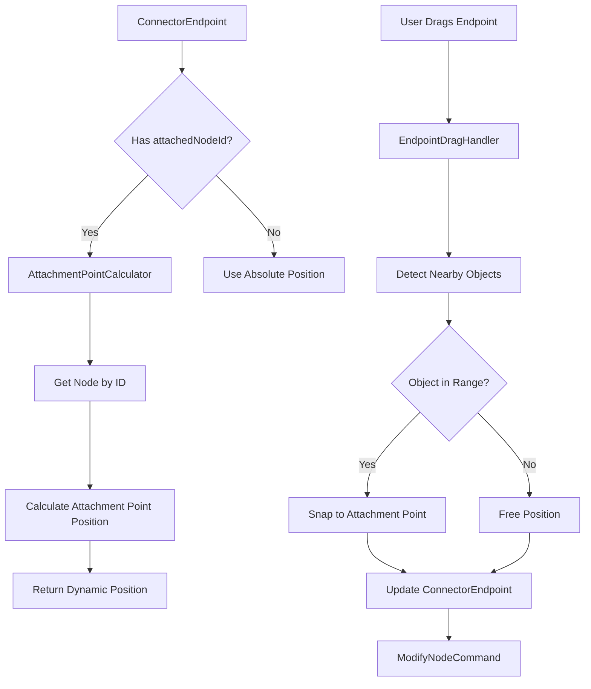

# Epic: Dynamic Connector Endpoint Editing

**Epic ID:** CONN-003
**Priority:** High
**Effort:** Medium
**Status:** Not Started
**Created:** 2026-02-16

---

## Executive Summary

Enable users to change connector start/end points to different objects after creation. Currently, connectors are locked to their initial objects, making it difficult to restructure diagrams. This epic adds the ability to drag connector endpoints to re-attach them to different objects.

---

## Problem Statement

Current limitations:
- Connectors are fixed to original start/end points
- No way to reconnect an existing connector to a different object
- Users must delete and recreate connectors to change connections
- Moving connected objects doesn't update connector attachment points
- No visual feedback when dragging endpoints near potential targets

---

## Goals

1. **Flexible Reconnection**: Drag endpoints to attach to different objects
2. **Smart Attachment**: Auto-detect and snap to object attachment points
3. **Visual Feedback**: Show valid targets and attachment points during drag
4. **Persistent Links**: Store connector-object relationships, not just coordinates
5. **Smooth UX**: Intuitive interaction that feels natural

---

## User Stories

### US-1: As a user, I want to drag connector endpoints to different objects
**Acceptance Criteria:**
- Dragging a connector endpoint detaches it from current object
- Dropping endpoint near another object attaches it
- Endpoint snaps to nearest attachment point on target object
- Visual indicator shows which object will be connected
- Works for both start and end points

### US-2: As a user, I want connectors to stay attached when moving objects
**Acceptance Criteria:**
- Moving an object updates all attached connector endpoints
- Connector follows object as it moves
- Attachment point remains consistent (e.g., always "right edge center")
- Multiple connectors on same object all update correctly

### US-3: As a user, I want to see available attachment points
**Acceptance Criteria:**
- Hovering near an object shows its attachment points
- Attachment points are clearly marked (dots/circles)
- Current attachment point is highlighted differently
- Invalid attachment points are dimmed or hidden

---

## Technical Approach

### Data Model Changes

#### Update ConnectorNode to use Object References
**File:** `lib/features/space/domain/models/objects/node.dart`

**Before (Position-based):**
```dart
class ConnectorNode {
  final Offset startPoint;
  final Offset endPoint;
}
```

**After (Reference-based):**
```dart
@freezed
class ConnectorNode with _$ConnectorNode implements Node {
  const factory ConnectorNode({
    required String id,

    // NEW: Object references instead of absolute positions
    required ConnectorEndpoint startEndpoint,
    required ConnectorEndpoint endEndpoint,

    // Legacy: Keep for backward compatibility
    @Deprecated('Use startEndpoint instead') Offset? startPoint,
    @Deprecated('Use endEndpoint instead') Offset? endPoint,

    // Styling
    @Default(0xFF000000) int color,
    @Default(2.0) double strokeWidth,
    @Default(ConnectorType.straight) ConnectorType type,
    Offset? controlPoint1,
    Offset? controlPoint2,
  }) = _ConnectorNode;

  // Computed properties
  Offset get startPosition => startEndpoint.position;
  Offset get endPosition => endEndpoint.position;
}

/// Represents one end of a connector
@freezed
class ConnectorEndpoint with _$ConnectorEndpoint {
  const factory ConnectorEndpoint({
    // Reference to attached node (null = free-floating)
    String? attachedNodeId,

    // Which attachment point on the node (if attached)
    AttachmentPoint? attachmentPoint,

    // Absolute position (used if not attached OR as fallback)
    required Offset position,
  }) = _ConnectorEndpoint;
}

/// Predefined attachment points on objects
enum AttachmentPoint {
  topLeft,
  topCenter,
  topRight,
  middleLeft,
  center,
  middleRight,
  bottomLeft,
  bottomCenter,
  bottomRight,

  // For custom attachment (percentage-based)
  custom,
}
```

#### New: AttachmentPointCalculator
**Purpose:** Calculate attachment point positions for any node

```dart
// lib/features/space/domain/utils/attachment_point_calculator.dart

class AttachmentPointCalculator {
  /// Get all attachment points for a node
  static Map<AttachmentPoint, Offset> getAttachmentPoints(Node node) {
    final bounds = _getNodeBounds(node);

    return {
      AttachmentPoint.topLeft: bounds.topLeft,
      AttachmentPoint.topCenter: Offset(bounds.center.dx, bounds.top),
      AttachmentPoint.topRight: bounds.topRight,
      AttachmentPoint.middleLeft: Offset(bounds.left, bounds.center.dy),
      AttachmentPoint.center: bounds.center,
      AttachmentPoint.middleRight: Offset(bounds.right, bounds.center.dy),
      AttachmentPoint.bottomLeft: bounds.bottomLeft,
      AttachmentPoint.bottomCenter: Offset(bounds.center.dx, bounds.bottom),
      AttachmentPoint.bottomRight: bounds.bottomRight,
    };
  }

  /// Find nearest attachment point to a given position
  static AttachmentPoint findNearestPoint(Node node, Offset position) {
    final points = getAttachmentPoints(node);
    AttachmentPoint? nearest;
    double minDistance = double.infinity;

    points.forEach((point, offset) {
      final distance = (offset - position).distance;
      if (distance < minDistance) {
        minDistance = distance;
        nearest = point;
      }
    });

    return nearest ?? AttachmentPoint.center;
  }

  /// Get position of a specific attachment point
  static Offset getPointPosition(Node node, AttachmentPoint point) {
    return getAttachmentPoints(node)[point] ?? _getNodeBounds(node).center;
  }

  static Rect _getNodeBounds(Node node) {
    return node.when(
      shape: (node) => node.rect,
      text: (node) => node.rect,
      image: (node) => node.rect,
      connector: (_) => throw ArgumentError('Cannot get bounds of connector'),
      group: (node) => _calculateGroupBounds(node),
      listOfPoint: (node) => _calculatePathBounds(node.points),
    );
  }
}
```

### Architecture



### Core Components

#### 1. ConnectorAttachmentManager
**Purpose:** Manage connector-object relationships

```dart
// lib/features/space/domain/managers/connector_attachment_manager.dart

class ConnectorAttachmentManager {
  final ShapeLayerBloc _shapeLayerBloc;

  /// Update connector positions when an object moves
  void updateConnectorsForNode(String nodeId, Offset delta) {
    final connectors = _findConnectorsAttachedTo(nodeId);

    for (final connector in connectors) {
      // Recalculate endpoint positions
      final updatedConnector = _recalculateConnectorPositions(connector);

      _shapeLayerBloc.add(
        ShapeLayerEvent.updateNode(updatedConnector),
      );
    }
  }

  /// Attach connector endpoint to a node
  ConnectorNode attachEndpoint({
    required ConnectorNode connector,
    required bool isStart, // true = start, false = end
    required String targetNodeId,
    required AttachmentPoint attachmentPoint,
  }) {
    final node = _getNodeById(targetNodeId);
    final position = AttachmentPointCalculator.getPointPosition(
      node,
      attachmentPoint,
    );

    final endpoint = ConnectorEndpoint(
      attachedNodeId: targetNodeId,
      attachmentPoint: attachmentPoint,
      position: position,
    );

    return isStart
        ? connector.copyWith(startEndpoint: endpoint)
        : connector.copyWith(endEndpoint: endpoint);
  }

  /// Detach endpoint (make it free-floating)
  ConnectorNode detachEndpoint({
    required ConnectorNode connector,
    required bool isStart,
    required Offset newPosition,
  }) {
    final endpoint = ConnectorEndpoint(
      attachedNodeId: null,
      attachmentPoint: null,
      position: newPosition,
    );

    return isStart
        ? connector.copyWith(startEndpoint: endpoint)
        : connector.copyWith(endEndpoint: endpoint);
  }

  /// Recalculate connector positions based on attached objects
  ConnectorNode _recalculateConnectorPositions(ConnectorNode connector) {
    var updated = connector;

    // Update start endpoint
    if (connector.startEndpoint.attachedNodeId != null) {
      final node = _getNodeById(connector.startEndpoint.attachedNodeId!);
      final newPosition = AttachmentPointCalculator.getPointPosition(
        node,
        connector.startEndpoint.attachmentPoint!,
      );
      updated = updated.copyWith.startEndpoint(position: newPosition);
    }

    // Update end endpoint
    if (connector.endEndpoint.attachedNodeId != null) {
      final node = _getNodeById(connector.endEndpoint.attachedNodeId!);
      final newPosition = AttachmentPointCalculator.getPointPosition(
        node,
        connector.endEndpoint.attachmentPoint!,
      );
      updated = updated.copyWith.endEndpoint(position: newPosition);
    }

    return updated;
  }

  List<ConnectorNode> _findConnectorsAttachedTo(String nodeId) {
    return _shapeLayerBloc.state.objects
        .whereType<ConnectorNode>()
        .where((c) =>
            c.startEndpoint.attachedNodeId == nodeId ||
            c.endEndpoint.attachedNodeId == nodeId)
        .toList();
  }
}
```

#### 2. EndpointDragHandler
**Purpose:** Handle dragging connector endpoints

```dart
// lib/features/space/view/pages/tool_handler/gestures/endpoint_drag_handler.dart

class EndpointDragHandler extends GestureHandler {
  static const double snapDistance = 20.0; // Snap within 20px

  String? _draggingConnectorId;
  bool? _isDraggingStart; // true = start, false = end
  Offset? _dragStartPosition;

  @override
  bool canHandle(GestureEvent event, BuildContext context) {
    if (event.type != GestureType.panStart) return false;

    // Check if tapping on a connector endpoint handle
    final connector = _findConnectorWithEndpointAt(event.worldPoint, context);
    if (connector != null) {
      _draggingConnectorId = connector.id;
      _isDraggingStart = _isNearStartPoint(event.worldPoint, connector);
      _dragStartPosition = event.worldPoint;
      return true;
    }

    return false;
  }

  @override
  void doHandle(GestureEvent event, BuildContext context) {
    final mediator = context.read<CanvasInteractionMediator>();
    final connector = _getCurrentConnector(context);
    if (connector == null) return;

    switch (event.type) {
      case GestureType.panUpdate:
        _handleDragUpdate(event, context, connector);
        break;
      case GestureType.panEnd:
        _handleDragEnd(event, context, connector);
        break;
      default:
        break;
    }
  }

  void _handleDragUpdate(GestureEvent event, BuildContext context, ConnectorNode connector) {
    final worldPoint = event.worldPoint;

    // Find nearby objects
    final nearbyNode = _findNearbyNode(worldPoint, context);

    if (nearbyNode != null) {
      // Show snap preview
      final attachmentPoint = AttachmentPointCalculator.findNearestPoint(
        nearbyNode,
        worldPoint,
      );

      context.read<ConnectorAttachmentPreviewBloc>().add(
        ShowSnapPreview(
          nodeId: nearbyNode.id,
          attachmentPoint: attachmentPoint,
        ),
      );
    } else {
      // Clear preview
      context.read<ConnectorAttachmentPreviewBloc>().add(
        HideSnapPreview(),
      );
    }

    // Update connector position temporarily (visual feedback)
    _updateConnectorEndpointVisual(context, connector, worldPoint);
  }

  void _handleDragEnd(GestureEvent event, BuildContext context, ConnectorNode connector) {
    final worldPoint = event.worldPoint;
    final manager = context.read<ConnectorAttachmentManager>();

    // Find target object
    final targetNode = _findNearbyNode(worldPoint, context);

    ConnectorNode updatedConnector;

    if (targetNode != null) {
      // Snap to attachment point
      final attachmentPoint = AttachmentPointCalculator.findNearestPoint(
        targetNode,
        worldPoint,
      );

      updatedConnector = manager.attachEndpoint(
        connector: connector,
        isStart: _isDraggingStart!,
        targetNodeId: targetNode.id,
        attachmentPoint: attachmentPoint,
      );
    } else {
      // Free-floating position
      updatedConnector = manager.detachEndpoint(
        connector: connector,
        isStart: _isDraggingStart!,
        newPosition: worldPoint,
      );
    }

    // Execute command (undo/redo support)
    final mediator = context.read<CanvasInteractionMediator>();
    mediator.executeCommand(
      ModifyNodeCommand(
        originalNode: connector,
        modifiedNode: updatedConnector,
      ),
    );

    // Clear preview
    context.read<ConnectorAttachmentPreviewBloc>().add(HideSnapPreview());

    // Reset state
    _draggingConnectorId = null;
    _isDraggingStart = null;
  }

  Node? _findNearbyNode(Offset point, BuildContext context) {
    final mediator = context.read<CanvasInteractionMediator>();
    final allNodes = context.read<ShapeLayerBloc>().state.objects;

    for (final node in allNodes) {
      if (node is ConnectorNode) continue; // Skip connectors

      final bounds = _getNodeBounds(node);
      final distance = _distanceToBounds(point, bounds);

      if (distance <= snapDistance) {
        return node;
      }
    }

    return null;
  }

  bool _isNearStartPoint(Offset point, ConnectorNode connector) {
    final startDistance = (point - connector.startPosition).distance;
    final endDistance = (point - connector.endPosition).distance;
    return startDistance < endDistance;
  }

  double _distanceToBounds(Offset point, Rect bounds) {
    // Distance from point to nearest edge of rect
    final dx = max(bounds.left - point.dx, max(0.0, point.dx - bounds.right));
    final dy = max(bounds.top - point.dy, max(0.0, point.dy - bounds.bottom));
    return sqrt(dx * dx + dy * dy);
  }
}
```

#### 3. AttachmentPointPainter
**Purpose:** Visualize attachment points

```dart
// lib/features/space/view/painters/attachment_point_painter.dart

class AttachmentPointPainter {
  static const double pointRadius = 4.0;
  static const double highlightRadius = 6.0;

  /// Draw attachment points on a node
  void paintAttachmentPoints(
    Canvas canvas,
    Node node, {
    AttachmentPoint? highlightedPoint,
  }) {
    final points = AttachmentPointCalculator.getAttachmentPoints(node);

    final normalPaint = Paint()
      ..color = Colors.blue.withOpacity(0.5)
      ..style = PaintingStyle.fill;

    final highlightPaint = Paint()
      ..color = Colors.blue
      ..style = PaintingStyle.fill;

    final borderPaint = Paint()
      ..color = Colors.white
      ..style = PaintingStyle.stroke
      ..strokeWidth = 1.5;

    points.forEach((point, position) {
      final isHighlighted = point == highlightedPoint;
      final radius = isHighlighted ? highlightRadius : pointRadius;
      final paint = isHighlighted ? highlightPaint : normalPaint;

      // Draw point
      canvas.drawCircle(position, radius, paint);
      canvas.drawCircle(position, radius, borderPaint);
    });
  }
}
```

### Modified Files

#### 1. Update MoveVisitor to Update Connectors
**File:** `lib/features/space/domain/models/objects/visitors/move_visitor.dart`

```dart
@override
Node visitShape(ShapeNode node) {
  final movedNode = node.copyWith(
    rect: node.rect.shift(delta),
  );

  // Update all connectors attached to this node
  _updateAttachedConnectors(node.id, delta);

  return movedNode;
}

void _updateAttachedConnectors(String nodeId, Offset delta) {
  // Notify ConnectorAttachmentManager to update connectors
  _attachmentManager?.updateConnectorsForNode(nodeId, delta);
}
```

#### 2. Update PaintVisitor for Attachment Points
**File:** `lib/features/space/domain/models/objects/visitors/paint_visitor.dart`

```dart
@override
void visitConnector(ConnectorNode node) {
  // ... existing connector rendering ...

  // Show attachment points when selected
  if (_isSelected(node)) {
    _drawAttachmentPointsForEndpoints(node);
  }
}

void _drawAttachmentPointsForEndpoints(ConnectorNode node) {
  final startNode = _getNodeById(node.startEndpoint.attachedNodeId);
  final endNode = _getNodeById(node.endEndpoint.attachedNodeId);

  if (startNode != null) {
    AttachmentPointPainter().paintAttachmentPoints(
      canvas,
      startNode,
      highlightedPoint: node.startEndpoint.attachmentPoint,
    );
  }

  if (endNode != null) {
    AttachmentPointPainter().paintAttachmentPoints(
      canvas,
      endNode,
      highlightedPoint: node.endEndpoint.attachmentPoint,
    );
  }
}
```

---

## Implementation Plan

### Phase 1: Data Model Migration (2 days)
- [ ] Create `ConnectorEndpoint` and `AttachmentPoint` models
- [ ] Update `ConnectorNode` with new fields
- [ ] Add backward compatibility for old connectors
- [ ] Migration script for existing data
- [ ] Unit tests for new models

### Phase 2: Attachment Point System (2-3 days)
- [ ] Implement `AttachmentPointCalculator`
- [ ] Create `ConnectorAttachmentManager`
- [ ] Add attachment point visualization
- [ ] Test attachment point calculations

### Phase 3: Endpoint Dragging (2-3 days)
- [ ] Implement `EndpointDragHandler`
- [ ] Add snap detection and preview
- [ ] Integrate with gesture handler chain
- [ ] Visual feedback during drag

### Phase 4: Auto-Update Connectors (1-2 days)
- [ ] Update `MoveVisitor` to notify connectors
- [ ] Add listener system for object movements
- [ ] Handle batch moves (multiple objects)
- [ ] Test with complex diagrams

### Phase 5: UI Polish (1-2 days)
- [ ] Smooth animations for snapping
- [ ] Cursor changes (grab, grabbing, pointer)
- [ ] Hover effects on attachment points
- [ ] Error states (invalid attachment)

### Phase 6: Edge Cases (1 day)
- [ ] Handle deletion of attached objects
- [ ] Handle grouped objects
- [ ] Handle undo/redo with attachments
- [ ] Circular connector detection

---

## Testing Strategy

### Unit Tests
```dart
group('AttachmentPointCalculator', () {
  test('calculates all 9 attachment points for rectangle', () {
    final node = ShapeNode(...);
    final points = AttachmentPointCalculator.getAttachmentPoints(node);
    expect(points.length, 9);
  });

  test('finds nearest attachment point', () {
    // Test nearest point calculation
  });
});

group('ConnectorAttachmentManager', () {
  test('attaches endpoint to node', () {
    // Test attachment
  });

  test('updates connector when attached node moves', () {
    // Test auto-update
  });

  test('handles deletion of attached node', () {
    // Test orphaned connectors
  });
});
```

### Integration Tests
```dart
testWidgets('drags connector endpoint to new object', (tester) async {
  // 1. Create connector between object A and B
  // 2. Drag end endpoint
  // 3. Drop on object C
  // 4. Verify connector now connects A to C
});

testWidgets('connector follows object when moved', (tester) async {
  // 1. Create connector attached to object
  // 2. Move object
  // 3. Verify connector endpoint moves with it
});
```

### Manual Testing Checklist
- [ ] Drag endpoint to different object
- [ ] Attachment points show when dragging near object
- [ ] Endpoint snaps to nearest point
- [ ] Free-floating endpoints work (no snap)
- [ ] Moving object updates connectors
- [ ] Undo/redo works correctly
- [ ] Deleting object handles attached connectors gracefully
- [ ] Performance with 20+ connectors

---

## Dependencies

- **Depends on:**
  - CONN-001 (Better Highlighting) - visual feedback for endpoints
  - Phase 2.2 Command Pattern - undo/redo support
- **Blocks:** CONN-004 (Magnetic Connectors) - shares attachment point system
- **Related to:** Selection system, Move operations

---

## Edge Cases & Solutions

### 1. Deleting Attached Objects
**Problem:** What happens when a connected object is deleted?

**Solutions:**
- **Option A (Recommended):** Delete connector automatically
- **Option B:** Detach endpoint, make it free-floating
- **Option C:** Ask user for confirmation

**Implementation:**
```dart
void onNodeDeleted(String nodeId) {
  final attachedConnectors = _findConnectorsAttachedTo(nodeId);

  for (final connector in attachedConnectors) {
    // Option A: Delete connector
    _shapeLayerBloc.add(ShapeLayerEvent.removeObject(connector.id));

    // OR Option B: Detach
    // final detached = _detachFromNode(connector, nodeId);
    // _shapeLayerBloc.add(ShapeLayerEvent.updateNode(detached));
  }
}
```

### 2. Circular Connectors
**Problem:** Connector from object to itself

**Solution:** Allow it, but use different attachment points
```dart
bool isCircular = connector.startEndpoint.attachedNodeId ==
                   connector.endEndpoint.attachedNodeId;

if (isCircular) {
  // Force different attachment points
  // e.g., topRight -> bottomRight for loop effect
}
```

### 3. Grouped Objects
**Problem:** Moving a group should update connectors attached to group members

**Solution:** Recursively update connectors for all group members
```dart
void updateConnectorsForGroup(GroupNode group, Offset delta) {
  for (final childId in group.childIds) {
    updateConnectorsForNode(childId, delta);
  }
}
```

---

## Performance Considerations

### Optimization Strategies
1. **Lazy Updates**: Only recalculate visible connectors
2. **Batch Updates**: Group connector updates when moving multiple objects
3. **Spatial Indexing**: Use QuadTree to find nearby objects during drag
4. **Caching**: Cache attachment point positions

### Expected Impact
- Connector position recalculation: <1ms per connector
- Snap detection: <2ms (with spatial indexing)
- Memory: +24 bytes per connector (attachmentNodeId + attachmentPoint)

---

## Success Metrics

### Quantitative
- Endpoint drag-and-drop success rate: >95%
- Snap accuracy: endpoints land on correct attachment point >98% of time
- No performance degradation with 50+ connected objects

### Qualitative
- Users report "much easier" to restructure diagrams
- Reduced time to reorganize complex diagrams by 50%
- Positive feedback on snap behavior

---

## Future Enhancements

1. **Custom Attachment Points**: User-defined points (percentage-based)
2. **Smart Routing**: Connectors avoid obstacles when objects move
3. **Port System**: Named ports (input/output) like flowchart tools
4. **Connection Rules**: Validation (e.g., "only connect outputs to inputs")
5. **Multi-Endpoint Connectors**: Tree/branch connectors
6. **Alignment Guides**: Show alignment when snapping

---

## References

- [Miro Connector Documentation](https://miro.com/)
- [Figma Auto-layout & Constraints](https://www.figma.com/best-practices/auto-layout-and-constraints/)
- [Graph Layout Algorithms](https://en.wikipedia.org/wiki/Graph_drawing)

---

## Notes

- Consider notification system (Observer pattern) for object move events
- Investigate incremental layout algorithms for large graphs
- May want to add "sticky" vs "floating" endpoint modes
- Consider accessibility (keyboard-only endpoint editing)

---

**Last Updated:** 2026-02-16
**Owner:** TBD
**Reviewers:** TBD
