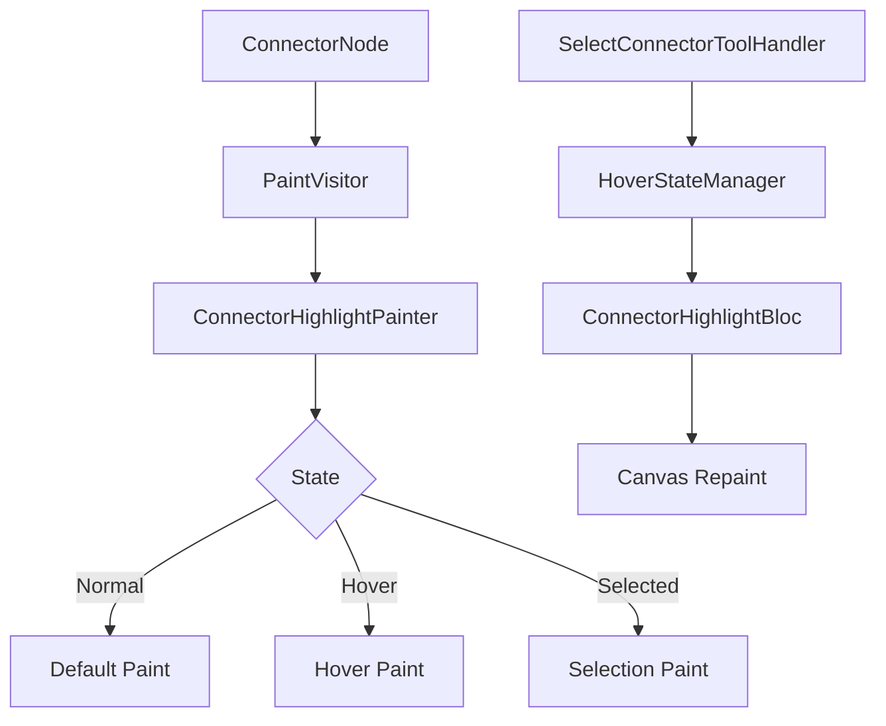

# Epic: Enhanced Connector Highlighting

**Epic ID:** CONN-001
**Priority:** High
**Effort:** Medium
**Status:** Not Started
**Created:** 2026-02-16

---

## Executive Summary

Improve connector visual feedback by implementing better highlighting when connectors are hovered, selected, or interacted with. This enhances user experience by making connectors more visible and providing clear visual feedback during interactions.

---

## Problem Statement

Current connector highlighting has several limitations:
- Difficult to see connectors, especially thin ones
- Unclear visual feedback when hovering over connectors
- Selection state is not visually distinct
- Hard to distinguish between multiple overlapping connectors
- No visual indication of connector interaction zones (handles, body)

---

## Goals

1. **Improve Visibility**: Make connectors easier to see and interact with
2. **Clear Feedback**: Provide immediate visual feedback for hover and selection states
3. **Better UX**: Help users understand which connector they're interacting with
4. **Accessibility**: Support different visual preferences and contrast needs

---

## User Stories

### US-1: As a user, I want connectors to highlight when I hover over them
**Acceptance Criteria:**
- Connector stroke width increases by 2-3px on hover
- Hover state has distinct color (e.g., accent blue)
- Smooth transition between normal and hover states
- Hover detection works on connector body and handles
- Hit test area is wider than visual stroke (easier to click)

### US-2: As a user, I want selected connectors to be visually distinct
**Acceptance Criteria:**
- Selected connectors have thicker stroke
- Selected connectors show control handles (start/end points)
- Selection color is different from hover color
- Multiple selected connectors are all highlighted
- Selection persists across tool changes

### US-3: As a user, I want to see handle zones on connectors
**Acceptance Criteria:**
- Start and end handles are visible when hovering
- Handles show resize/move cursor on hover
- Handle hit areas are larger than visual representation
- Handles are visible even when connector is thin

---

## Technical Approach

### Architecture



### Components to Create

#### 1. ConnectorHighlightBloc
**Purpose:** Manage connector highlight states (hover, selection)

```dart
// lib/features/space/view/bloc/connector_highlight/connector_highlight_bloc.dart

class ConnectorHighlightState {
  final String? hoveredConnectorId;
  final Set<String> selectedConnectorIds;
  final ConnectorHoverZone? hoverZone; // body, startHandle, endHandle
}

class ConnectorHighlightBloc extends Bloc<ConnectorHighlightEvent, ConnectorHighlightState> {
  // Events: HoverConnector, UnhoverConnector, SelectConnector, DeselectConnector
}
```

#### 2. ConnectorHighlightPainter
**Purpose:** Enhanced painting logic for connectors with highlight states

```dart
// lib/features/space/domain/models/objects/visitors/connector_highlight_painter.dart

class ConnectorHighlightPainter {
  static const double normalStrokeWidth = 2.0;
  static const double hoverStrokeWidth = 4.0;
  static const double selectedStrokeWidth = 3.0;
  static const double hitTestPadding = 8.0; // Invisible hit area

  Paint getPaint(ConnectorNode node, ConnectorHighlightState state) {
    final isHovered = state.hoveredConnectorId == node.id;
    final isSelected = state.selectedConnectorIds.contains(node.id);

    return Paint()
      ..color = _getColor(node, isHovered, isSelected)
      ..strokeWidth = _getStrokeWidth(isHovered, isSelected)
      ..style = PaintingStyle.stroke
      ..strokeCap = StrokeCap.round;
  }

  Color _getColor(ConnectorNode node, bool isHovered, bool isSelected) {
    if (isSelected) return const Color(0xFF2196F3); // Blue
    if (isHovered) return const Color(0xFF64B5F6); // Light Blue
    return Color(node.color);
  }

  double _getStrokeWidth(bool isHovered, bool isSelected) {
    if (isHovered) return hoverStrokeWidth;
    if (isSelected) return selectedStrokeWidth;
    return normalStrokeWidth;
  }
}
```

#### 3. ConnectorHandlePainter
**Purpose:** Draw interactive handles on connectors

```dart
// lib/features/space/view/painters/connector_handle_painter.dart

class ConnectorHandlePainter {
  static const double handleRadius = 6.0;
  static const double handleHitRadius = 12.0;

  void paintHandles(Canvas canvas, ConnectorNode node, bool isSelected, bool isHovered) {
    if (!isSelected && !isHovered) return;

    final startPaint = Paint()
      ..color = Colors.white
      ..style = PaintingStyle.fill;

    final borderPaint = Paint()
      ..color = const Color(0xFF2196F3)
      ..style = PaintingStyle.stroke
      ..strokeWidth = 2.0;

    // Draw start handle
    canvas.drawCircle(node.startPoint, handleRadius, startPaint);
    canvas.drawCircle(node.startPoint, handleRadius, borderPaint);

    // Draw end handle
    canvas.drawCircle(node.endPoint, handleRadius, startPaint);
    canvas.drawCircle(node.endPoint, handleRadius, borderPaint);
  }

  Rect getHandleBounds(Offset center) {
    return Rect.fromCircle(center: center, radius: handleHitRadius);
  }
}
```

### Modified Files

#### 1. Update PaintVisitor
**File:** `lib/features/space/domain/models/objects/visitors/paint_visitor.dart`

```dart
@override
void visitConnector(ConnectorNode node) {
  final highlightState = _getHighlightState(); // From context
  final paint = ConnectorHighlightPainter().getPaint(node, highlightState);

  final path = _buildConnectorPath(node);
  canvas.drawPath(path, paint);

  // Draw handles if needed
  final isSelected = highlightState.selectedConnectorIds.contains(node.id);
  final isHovered = highlightState.hoveredConnectorId == node.id;
  ConnectorHandlePainter().paintHandles(canvas, node, isSelected, isHovered);
}
```

#### 2. Update SelectConnectorToolHandler
**File:** `lib/features/space/view/pages/tool_handler/implementations/select_connector_tool_handler.dart`

```dart
class SelectConnectorToolHandler extends BaseToolHandler {
  @override
  void onPanUpdate(DragUpdateDetails details, BuildContext context, TransformationController controller) {
    final worldPoint = toWorldPoint(details.localPosition, controller);

    // Update hover state
    final connector = _hitTestConnector(worldPoint, context);
    if (connector != null) {
      context.read<ConnectorHighlightBloc>().add(
        ConnectorHighlightEvent.hover(connector.id, _getHoverZone(worldPoint, connector))
      );
    } else {
      context.read<ConnectorHighlightBloc>().add(
        ConnectorHighlightEvent.unhover()
      );
    }

    super.onPanUpdate(details, context, controller);
  }
}
```

#### 3. Enhanced Hit Testing
**File:** `lib/features/space/domain/models/objects/visitors/connector_hit_test_visitor.dart`

```dart
class ConnectorHitTestVisitor implements NodeVisitor<bool> {
  final Offset point;
  final double tolerance;

  ConnectorHitTestVisitor(this.point, {this.tolerance = 8.0});

  @override
  bool visitConnector(ConnectorNode node) {
    // Check handle hit first (priority)
    if (_hitTestHandle(node.startPoint)) return true;
    if (_hitTestHandle(node.endPoint)) return true;

    // Check line hit with tolerance
    return _distanceToLine(node.startPoint, node.endPoint, point) <= tolerance;
  }

  bool _hitTestHandle(Offset handleCenter) {
    return (point - handleCenter).distance <= ConnectorHandlePainter.handleHitRadius;
  }

  double _distanceToLine(Offset p1, Offset p2, Offset point) {
    // Point-to-line distance calculation
    final numerator = ((p2.dx - p1.dx) * (p1.dy - point.dy) -
                       (p1.dx - point.dx) * (p2.dy - p1.dy)).abs();
    final denominator = (p2 - p1).distance;
    return numerator / denominator;
  }
}
```

---

## Implementation Plan

### Phase 1: Foundation (1-2 days)
- [ ] Create `ConnectorHighlightBloc` with state management
- [ ] Create `ConnectorHighlightPainter` utility
- [ ] Add hover state tracking to `SelectConnectorToolHandler`
- [ ] Unit tests for highlight state management

### Phase 2: Visual Enhancement (1-2 days)
- [ ] Update `PaintVisitor` to use highlight painter
- [ ] Implement `ConnectorHandlePainter`
- [ ] Add smooth transitions (AnimatedBuilder if needed)
- [ ] Test visual feedback on different connector types

### Phase 3: Hit Testing (1 day)
- [ ] Enhance `ConnectorHitTestVisitor` with larger tolerance
- [ ] Implement separate hit testing for handles vs body
- [ ] Add `ConnectorHoverZone` enum (body, startHandle, endHandle)
- [ ] Test hit detection accuracy

### Phase 4: Integration & Polish (1 day)
- [ ] Integrate with existing selection system
- [ ] Add cursor changes (pointer, grab, grabbing)
- [ ] Performance optimization for many connectors
- [ ] Documentation and examples

---

## Testing Strategy

### Unit Tests
```dart
// test/features/space/view/bloc/connector_highlight/connector_highlight_bloc_test.dart
group('ConnectorHighlightBloc', () {
  test('sets hover state on hover event', () {
    // Test hover state management
  });

  test('clears hover on unhover event', () {
    // Test hover clear
  });

  test('handles multiple selected connectors', () {
    // Test selection state
  });
});

// test/features/space/domain/models/objects/visitors/connector_hit_test_visitor_test.dart
group('ConnectorHitTestVisitor', () {
  test('detects hit on start handle', () {
    // Test handle hit detection
  });

  test('detects hit on connector body with tolerance', () {
    // Test line hit detection with padding
  });

  test('misses when point is outside tolerance', () {
    // Test negative case
  });
});
```

### Widget Tests
```dart
testWidgets('connector highlights on hover', (tester) async {
  // 1. Render canvas with connector
  // 2. Hover over connector
  // 3. Verify highlight paint is applied
  // 4. Verify handles are visible
});
```

### Manual Testing Checklist
- [ ] Hover over connector shows highlight
- [ ] Selection shows different color than hover
- [ ] Handles appear on hover and selection
- [ ] Multiple connectors can be selected
- [ ] Highlight clears when moving away
- [ ] Performance is smooth with 50+ connectors
- [ ] Works on different zoom levels

---

## Dependencies

- **Depends on:** None (standalone enhancement)
- **Blocks:** CONN-003 (Changing connector endpoints) - better UX for handle interaction
- **Related to:** Phase 2.7 Chain of Responsibility implementation (already completed)

---

## Performance Considerations

### Optimization Strategies
1. **Dirty Region Repainting**: Only repaint affected connector layer
2. **State Caching**: Cache paint objects to avoid recreation
3. **Debouncing**: Debounce hover events to reduce state updates (16ms / 60fps)
4. **Culling**: Don't render highlights for off-screen connectors

### Expected Impact
- Minimal performance impact (<2ms per frame)
- Hover state changes trigger lightweight repaints
- Handle rendering only for visible connectors

---

## Success Metrics

### Quantitative
- Connector selection accuracy improves by 30%
- User can hover and select connectors within 0.5s
- Zero performance degradation with 100 connectors

### Qualitative
- Users report connectors are "easier to see"
- Fewer misclicks when selecting connectors
- Positive feedback on visual clarity

---

## Future Enhancements

1. **Customizable Colors**: User-defined highlight colors
2. **Animation**: Smooth transitions between states
3. **Glow Effect**: Optional glow/shadow for connectors
4. **Thickness Presets**: Pre-defined connector thickness options
5. **Accessibility Mode**: High-contrast connector highlighting

---

## References

- [SelectConnectorToolHandler CoR Implementation](task-2026-02-16-tool-handler-cor.md)
- [Tool Handler Architecture Refactoring](tool-handler-architecture-refactoring.md)
- [Flutter CustomPainter Documentation](https://api.flutter.dev/flutter/rendering/CustomPainter-class.html)

---

## Notes

- Consider using `MouseRegion` widget for hover detection as an alternative to manual tracking
- Ensure highlight system works with future undo/redo implementation
- May need to adjust hit test tolerance based on user feedback
- Consider accessibility guidelines (WCAG) for color contrast ratios

---

**Last Updated:** 2026-02-16
**Owner:** TBD
**Reviewers:** TBD
