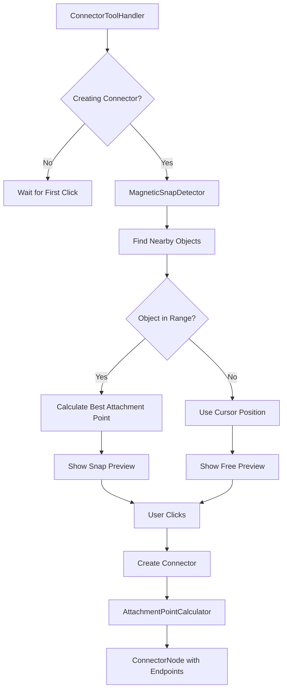

# Epic: Magnetic Connector Creation

**Epic ID:** CONN-004
**Priority:** High
**Effort:** Medium
**Status:** Not Started
**Created:** 2026-02-16

---

## Executive Summary

Implement magnetic snapping when creating connectors, making it easy to start and end connectors precisely on objects. The magnetic effect detects nearby objects and automatically snaps the connector endpoint to the optimal attachment point, dramatically improving usability and reducing precision requirements.

---

## Problem Statement

Current connector creation challenges:
- Difficult to precisely click on objects to start/end connectors
- No visual feedback showing where connector will attach
- Users must aim perfectly at object edges
- Starting point doesn't snap to logical attachment points
- Connectors often miss objects by a few pixels
- No indication which object will be connected

---

## Goals

1. **Effortless Creation**: Users don't need pixel-perfect accuracy
2. **Magnetic Snapping**: Auto-detect and snap to nearby objects
3. **Visual Preview**: Show connection preview before committing
4. **Smart Placement**: Choose optimal attachment point automatically
5. **Consistent UX**: Works for both start and end points

---

## User Stories

### US-1: As a user, I want connectors to snap to objects automatically
**Acceptance Criteria:**
- Clicking near an object (within ~30px) snaps connector to it
- Connector snaps to the nearest attachment point on the object
- Visual feedback shows the snap target before clicking
- Snap works for both starting and ending connector
- Can disable snapping with modifier key (Shift)

### US-2: As a user, I want to see a preview of the connection
**Acceptance Criteria:**
- Hovering near an object shows a preview line
- Preview line animates from start point to hover position
- Target object highlights when in snap range
- Attachment point is marked with a dot/circle
- Preview updates in real-time as mouse moves

### US-3: As a user, I want intelligent attachment point selection
**Acceptance Criteria:**
- System chooses the nearest attachment point automatically
- Considers object orientation (prefer edges over corners when appropriate)
- For opposite sides, prefers horizontal connections (left/right)
- Respects user intent based on approach angle
- Option to manually select attachment point before clicking

---

## Technical Approach

### Architecture



### Core Components

#### 1. MagneticSnapDetector
**Purpose:** Detect nearby objects and calculate snap targets

```dart
// lib/features/space/domain/utils/magnetic_snap_detector.dart

class MagneticSnapDetector {
  static const double snapRadius = 30.0; // Pixels
  static const double strongSnapRadius = 15.0; // Strong magnetic pull

  /// Find the best snap target near a point
  SnapTarget? findSnapTarget({
    required Offset point,
    required List<Node> allNodes,
    String? excludeNodeId, // Don't snap to self
  }) {
    SnapTarget? bestTarget;
    double minDistance = snapRadius;

    for (final node in allNodes) {
      if (node.id == excludeNodeId) continue;
      if (node is ConnectorNode) continue; // Don't snap to connectors

      final target = _calculateSnapTarget(node, point);
      if (target == null) continue;

      if (target.distance < minDistance) {
        minDistance = target.distance;
        bestTarget = target;
      }
    }

    return bestTarget;
  }

  SnapTarget? _calculateSnapTarget(Node node, Offset point) {
    final bounds = _getNodeBounds(node);

    // Check if point is near the node
    final distanceToBounds = _distanceToBounds(point, bounds);
    if (distanceToBounds > snapRadius) return null;

    // Find best attachment point
    final attachmentPoint = _selectBestAttachmentPoint(node, point);
    final snapPosition = AttachmentPointCalculator.getPointPosition(
      node,
      attachmentPoint,
    );

    final distance = (point - snapPosition).distance;

    return SnapTarget(
      nodeId: node.id,
      node: node,
      attachmentPoint: attachmentPoint,
      snapPosition: snapPosition,
      distance: distance,
      magneticStrength: _calculateMagneticStrength(distance),
    );
  }

  /// Select best attachment point based on approach angle
  AttachmentPoint _selectBestAttachmentPoint(Node node, Offset point) {
    final bounds = _getNodeBounds(node);
    final center = bounds.center;

    // Calculate approach angle (where user is coming from)
    final angle = (point - center).direction;

    // Snap to edge closest to approach angle
    // Right: -45° to 45°
    // Bottom: 45° to 135°
    // Left: 135° to -135°
    // Top: -135° to -45°

    if (angle >= -pi / 4 && angle < pi / 4) {
      return AttachmentPoint.middleRight;
    } else if (angle >= pi / 4 && angle < 3 * pi / 4) {
      return AttachmentPoint.bottomCenter;
    } else if (angle >= 3 * pi / 4 || angle < -3 * pi / 4) {
      return AttachmentPoint.middleLeft;
    } else {
      return AttachmentPoint.topCenter;
    }
  }

  /// Calculate magnetic strength (0.0 to 1.0)
  double _calculateMagneticStrength(double distance) {
    if (distance <= strongSnapRadius) {
      return 1.0; // Full magnetic pull
    } else if (distance <= snapRadius) {
      // Gradual falloff
      return 1.0 - ((distance - strongSnapRadius) / (snapRadius - strongSnapRadius));
    } else {
      return 0.0;
    }
  }

  double _distanceToBounds(Offset point, Rect bounds) {
    final dx = max(bounds.left - point.dx, max(0.0, point.dx - bounds.right));
    final dy = max(bounds.top - point.dy, max(0.0, point.dy - bounds.bottom));
    return sqrt(dx * dx + dy * dy);
  }
}

/// Represents a snap target
class SnapTarget {
  final String nodeId;
  final Node node;
  final AttachmentPoint attachmentPoint;
  final Offset snapPosition;
  final double distance;
  final double magneticStrength; // 0.0 to 1.0

  const SnapTarget({
    required this.nodeId,
    required this.node,
    required this.attachmentPoint,
    required this.snapPosition,
    required this.distance,
    required this.magneticStrength,
  });

  bool get isStrongSnap => magneticStrength > 0.7;
}
```

#### 2. ConnectorPreviewPainter
**Purpose:** Draw preview line during connector creation

```dart
// lib/features/space/view/painters/connector_preview_painter.dart

class ConnectorPreviewPainter extends CustomPainter {
  final Offset startPoint;
  final Offset endPoint;
  final SnapTarget? snapTarget;
  final bool isSnapped;

  ConnectorPreviewPainter({
    required this.startPoint,
    required this.endPoint,
    this.snapTarget,
    this.isSnapped = false,
  });

  @override
  void paint(Canvas canvas, Size size) {
    // Draw preview line
    final linePaint = Paint()
      ..color = isSnapped
          ? Colors.blue.withOpacity(0.8)
          : Colors.grey.withOpacity(0.5)
      ..strokeWidth = isSnapped ? 3.0 : 2.0
      ..style = PaintingStyle.stroke
      ..strokeCap = StrokeCap.round;

    // Use dashed line for non-snapped
    if (!isSnapped) {
      _drawDashedLine(canvas, startPoint, endPoint, linePaint);
    } else {
      canvas.drawLine(startPoint, endPoint, linePaint);
    }

    // Draw snap indicator at attachment point
    if (snapTarget != null) {
      _drawSnapIndicator(canvas, snapTarget!);
    }
  }

  void _drawSnapIndicator(Canvas canvas, SnapTarget target) {
    final position = target.snapPosition;
    final strength = target.magneticStrength;

    // Pulsing circle effect
    final radius = 8.0 + (strength * 4.0);

    // Outer glow
    final glowPaint = Paint()
      ..color = Colors.blue.withOpacity(0.3 * strength)
      ..maskFilter = const MaskFilter.blur(BlurStyle.normal, 4);

    canvas.drawCircle(position, radius + 4, glowPaint);

    // Inner circle
    final circlePaint = Paint()
      ..color = Colors.blue.withOpacity(0.8)
      ..style = PaintingStyle.fill;

    canvas.drawCircle(position, radius, circlePaint);

    // White border
    final borderPaint = Paint()
      ..color = Colors.white
      ..style = PaintingStyle.stroke
      ..strokeWidth = 2.0;

    canvas.drawCircle(position, radius, borderPaint);
  }

  void _drawDashedLine(Canvas canvas, Offset start, Offset end, Paint paint) {
    const dashLength = 5.0;
    const dashSpace = 3.0;

    final distance = (end - start).distance;
    final direction = (end - start) / distance;

    double currentDistance = 0;
    bool isDash = true;

    while (currentDistance < distance) {
      final segmentLength = isDash ? dashLength : dashSpace;
      final segmentEnd = min(currentDistance + segmentLength, distance);

      if (isDash) {
        final segmentStart = start + direction * currentDistance;
        final segmentEndPoint = start + direction * segmentEnd;
        canvas.drawLine(segmentStart, segmentEndPoint, paint);
      }

      currentDistance = segmentEnd;
      isDash = !isDash;
    }
  }

  @override
  bool shouldRepaint(ConnectorPreviewPainter oldDelegate) {
    return startPoint != oldDelegate.startPoint ||
        endPoint != oldDelegate.endPoint ||
        snapTarget != oldDelegate.snapTarget ||
        isSnapped != oldDelegate.isSnapped;
  }
}
```

#### 3. Update ConnectorToolHandler with Magnetic Snapping
**File:** `lib/features/space/view/pages/tool_handler/implementations/connector_tool_handler.dart`

```dart
class ConnectorToolHandler extends BaseToolHandler {
  SnapTarget? _startSnapTarget;
  SnapTarget? _currentHoverTarget;
  Offset? _connectorStartPoint;

  @override
  void onTapUp(TapUpDetails details, BuildContext context, TransformationController controller) {
    final worldPoint = toWorldPoint(details.localPosition, controller);
    final mediator = getMediator(context);

    // Check for magnetic snap (unless Shift is held for free placement)
    final snapEnabled = !HardwareKeyboard.instance.isShiftPressed;
    SnapTarget? snapTarget;

    if (snapEnabled) {
      final allNodes = context.read<ShapeLayerBloc>().state.objects;
      snapTarget = MagneticSnapDetector().findSnapTarget(
        point: worldPoint,
        allNodes: allNodes,
      );
    }

    if (_connectorStartPoint == null) {
      // Start connector
      final startPoint = snapTarget?.snapPosition ?? worldPoint;
      _connectorStartPoint = startPoint;
      _startSnapTarget = snapTarget;

      mediator.startConnector(startPoint);
    } else {
      // Complete connector
      final startPoint = _connectorStartPoint!;
      final endPoint = snapTarget?.snapPosition ?? worldPoint;

      final connector = ConnectorNode(
        id: const Uuid().v4(),
        startEndpoint: ConnectorEndpoint(
          attachedNodeId: _startSnapTarget?.nodeId,
          attachmentPoint: _startSnapTarget?.attachmentPoint,
          position: startPoint,
        ),
        endEndpoint: ConnectorEndpoint(
          attachedNodeId: snapTarget?.nodeId,
          attachmentPoint: snapTarget?.attachmentPoint,
          position: endPoint,
        ),
        type: _connectorType,
      );

      mediator.addNode(connector);
      mediator.endConnector();

      // Reset state
      _connectorStartPoint = null;
      _startSnapTarget = null;
      _currentHoverTarget = null;
    }
  }

  @override
  void onPanUpdate(DragUpdateDetails details, BuildContext context, TransformationController controller) {
    if (_connectorStartPoint == null) return;

    final worldPoint = toWorldPoint(details.localPosition, controller);
    final allNodes = context.read<ShapeLayerBloc>().state.objects;

    // Detect snap target
    final snapEnabled = !HardwareKeyboard.instance.isShiftPressed;
    _currentHoverTarget = snapEnabled
        ? MagneticSnapDetector().findSnapTarget(
            point: worldPoint,
            allNodes: allNodes,
            excludeNodeId: _startSnapTarget?.nodeId, // Don't snap to start node
          )
        : null;

    // Update preview
    context.read<ConnectorPreviewBloc>().add(
      UpdatePreview(
        startPoint: _connectorStartPoint!,
        endPoint: _currentHoverTarget?.snapPosition ?? worldPoint,
        snapTarget: _currentHoverTarget,
      ),
    );

    // Trigger repaint
    // (This would be handled by the BLoC state change)
  }
}
```

#### 4. ConnectorPreviewBloc
**Purpose:** Manage connector preview state

```dart
// lib/features/space/view/bloc/connector_preview/connector_preview_bloc.dart

class ConnectorPreviewState {
  final Offset? startPoint;
  final Offset? endPoint;
  final SnapTarget? snapTarget;
  final bool isVisible;

  const ConnectorPreviewState({
    this.startPoint,
    this.endPoint,
    this.snapTarget,
    this.isVisible = false,
  });
}

class ConnectorPreviewBloc extends Bloc<ConnectorPreviewEvent, ConnectorPreviewState> {
  ConnectorPreviewBloc() : super(const ConnectorPreviewState()) {
    on<UpdatePreview>((event, emit) {
      emit(ConnectorPreviewState(
        startPoint: event.startPoint,
        endPoint: event.endPoint,
        snapTarget: event.snapTarget,
        isVisible: true,
      ));
    });

    on<HidePreview>((event, emit) {
      emit(const ConnectorPreviewState(isVisible: false));
    });
  }
}
```

#### 5. ConnectorPreviewLayer Widget
**Purpose:** Render preview overlay on canvas

```dart
// lib/features/space/view/widgets/connector_preview_layer.dart

class ConnectorPreviewLayer extends StatelessWidget {
  final TransformationController transformationController;

  const ConnectorPreviewLayer({
    required this.transformationController,
    super.key,
  });

  @override
  Widget build(BuildContext context) {
    return BlocBuilder<ConnectorPreviewBloc, ConnectorPreviewState>(
      builder: (context, state) {
        if (!state.isVisible || state.startPoint == null || state.endPoint == null) {
          return const SizedBox.shrink();
        }

        return CustomPaint(
          painter: ConnectorPreviewPainter(
            startPoint: state.startPoint!,
            endPoint: state.endPoint!,
            snapTarget: state.snapTarget,
            isSnapped: state.snapTarget != null,
          ),
          child: const SizedBox.expand(),
        );
      },
    );
  }
}
```

---

## Implementation Plan

### Phase 1: Snap Detection (2 days)
- [ ] Implement `MagneticSnapDetector`
- [ ] Add `SnapTarget` model
- [ ] Test snap detection accuracy
- [ ] Add configuration for snap radius

### Phase 2: Visual Preview (2 days)
- [ ] Create `ConnectorPreviewPainter`
- [ ] Implement `ConnectorPreviewBloc`
- [ ] Add `ConnectorPreviewLayer` widget
- [ ] Test preview rendering

### Phase 3: Tool Integration (1-2 days)
- [ ] Update `ConnectorToolHandler` with magnetic logic
- [ ] Add keyboard modifier support (Shift to disable)
- [ ] Handle edge cases (no snap targets, overlapping objects)
- [ ] Test connector creation flow

### Phase 4: Smart Attachment Selection (1 day)
- [ ] Implement approach angle detection
- [ ] Add preference for edge vs corner attachment
- [ ] Test with various object configurations
- [ ] Fine-tune attachment point selection

### Phase 5: Polish & UX (1-2 days)
- [ ] Add smooth animations for snap effect
- [ ] Implement magnetic "pull" feeling
- [ ] Add audio/haptic feedback (optional)
- [ ] Cursor changes during snap
- [ ] Adjust visual feedback based on user testing

### Phase 6: Settings & Configuration (1 day)
- [ ] Add user settings for snap sensitivity
- [ ] Toggle magnetic snapping on/off
- [ ] Adjust snap radius
- [ ] Preference for attachment point algorithm

---

## Testing Strategy

### Unit Tests
```dart
group('MagneticSnapDetector', () {
  test('finds snap target within radius', () {
    final detector = MagneticSnapDetector();
    final nodes = [
      ShapeNode(id: '1', rect: Rect.fromLTWH(100, 100, 50, 50)),
    ];

    final target = detector.findSnapTarget(
      point: Offset(125, 85), // Above top edge
      allNodes: nodes,
    );

    expect(target, isNotNull);
    expect(target!.nodeId, '1');
    expect(target.attachmentPoint, AttachmentPoint.topCenter);
  });

  test('returns null when no objects in range', () {
    final detector = MagneticSnapDetector();
    final nodes = [
      ShapeNode(id: '1', rect: Rect.fromLTWH(100, 100, 50, 50)),
    ];

    final target = detector.findSnapTarget(
      point: Offset(200, 200), // Far away
      allNodes: nodes,
    );

    expect(target, isNull);
  });

  test('selects best attachment point based on approach angle', () {
    // Test approach from different angles
  });

  test('excludes specified nodes from snap detection', () {
    // Test exclude parameter
  });
});
```

### Widget Tests
```dart
testWidgets('shows preview line when creating connector', (tester) async {
  // 1. Render canvas
  // 2. Select connector tool
  // 3. Click start point
  // 4. Move mouse (should show preview)
  // 5. Verify ConnectorPreviewLayer is visible
});

testWidgets('preview snaps to nearby object', (tester) async {
  // 1. Create object at position
  // 2. Start connector
  // 3. Move mouse near object
  // 4. Verify preview snaps to attachment point
  // 5. Verify snap indicator is visible
});
```

### Manual Testing Checklist
- [ ] Connector snaps to objects within ~30px
- [ ] Preview line follows cursor smoothly
- [ ] Snap indicator appears at attachment point
- [ ] Holding Shift disables snapping
- [ ] Snapping works for both start and end points
- [ ] Attachment point selection feels intuitive
- [ ] Preview updates at 60fps
- [ ] Works with zoomed in/out canvas
- [ ] Works with rotated objects

---

## Dependencies

- **Depends on:**
  - CONN-003 (Endpoint Editing) - shares `AttachmentPointCalculator`
  - CONN-001 (Better Highlighting) - visual feedback system
- **Blocks:** None
- **Related to:** Selection system, Tool handler architecture

---

## Configuration & Settings

### User-Configurable Options
```dart
class MagneticSnapSettings {
  final bool enabled;
  final double snapRadius; // Default: 30px
  final double strongSnapRadius; // Default: 15px
  final bool showPreview; // Default: true
  final bool audioFeedback; // Default: false
  final AttachmentPointAlgorithm algorithm; // smart, nearest, manual

  const MagneticSnapSettings({
    this.enabled = true,
    this.snapRadius = 30.0,
    this.strongSnapRadius = 15.0,
    this.showPreview = true,
    this.audioFeedback = false,
    this.algorithm = AttachmentPointAlgorithm.smart,
  });
}
```

---

## Performance Considerations

### Optimization Strategies
1. **Spatial Indexing**: Use QuadTree for O(log n) nearest neighbor search
2. **Debouncing**: Throttle hover events to 60fps (16ms)
3. **Lazy Rendering**: Only render preview when hovering
4. **Early Exit**: Skip snap detection when far from all objects

### Expected Impact
- Snap detection: <2ms per frame (with QuadTree)
- Preview rendering: <1ms per frame
- Memory: +16 bytes for preview state

---

## Success Metrics

### Quantitative
- Connector creation accuracy improves by 80% (fewer misplaced connectors)
- Time to create connector reduces by 40%
- User creates connectors successfully 95%+ of attempts

### Qualitative
- Users report "effortless" connector creation
- Reduced frustration with precision requirements
- Positive feedback on snap behavior

---

## Accessibility Considerations

1. **Keyboard-only Creation**: Support Tab to cycle through snap targets
2. **High Contrast Mode**: Ensure snap indicators are visible
3. **Screen Reader**: Announce snap targets ("Snapping to Rectangle 1, right edge")
4. **Haptic Feedback**: Vibration when snapping (mobile/trackpad)

---

## Future Enhancements

1. **Multi-Object Snap**: Show multiple snap candidates, let user choose
2. **Snap Guides**: Alignment guides when snapping
3. **Snap History**: Remember frequently used attachment points
4. **Smart Routing**: Combine with CONN-002 (Bézier) for optimal curves
5. **Snap Predictions**: ML-based prediction of intended attachment point
6. **Grid Snapping**: Snap to canvas grid in addition to objects
7. **Connector Templates**: Quick-create common connector patterns

---

## References

- [Figma Smart Selection](https://www.figma.com/blog/introducing-smart-selection/)
- [Sketch Snapping Behavior](https://www.sketch.com/docs/vector-editing/snapping/)
- [Magnetic Attraction in UI Design](https://www.nngroup.com/articles/snapping/)

---

## Notes

- Consider adding subtle animation when snap occurs (elastic easing)
- May want to add different snap behaviors for different tools
- Consider "snap override" - click and drag to force free placement
- Test with touchscreen devices (larger snap radius needed?)
- Consider adding snap sound effect (optional, toggleable)

---

**Last Updated:** 2026-02-16
**Owner:** TBD
**Reviewers:** TBD
