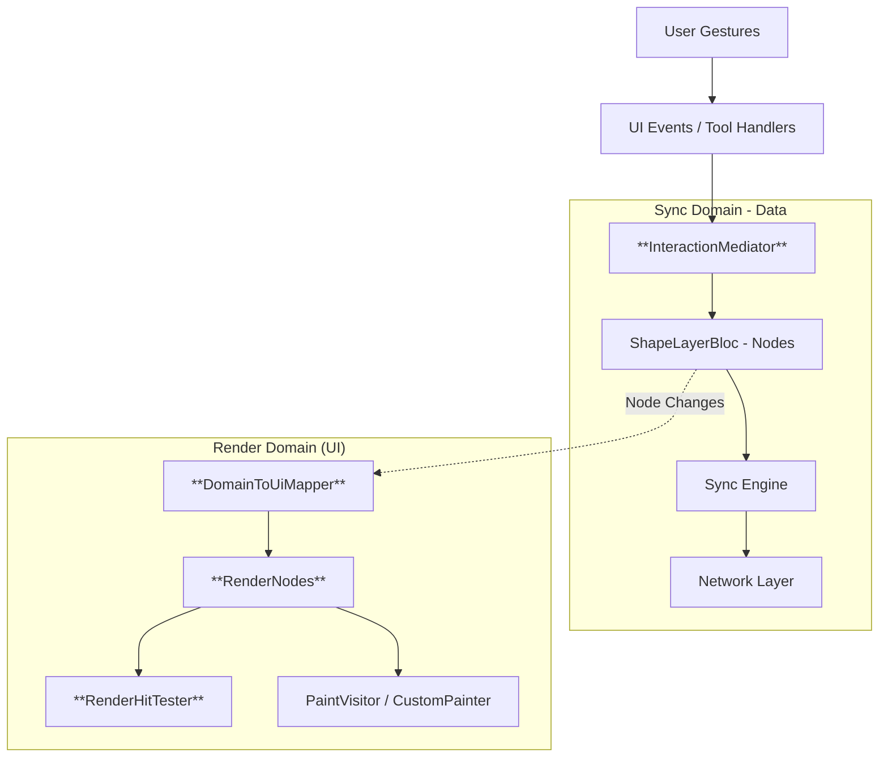
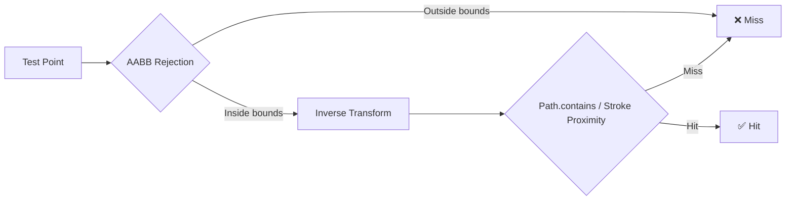

# **High-Level Flutter Architecture for Multiplayer Canvas**

To implement the "Last Write Wins" strategies effectively while ensuring 60fps rendering, we separate the **Sync Domain** (Data) from the **Render Domain** (UI).

A **Mapper Layer** (`DomainToUiMapper`) bridges these two worlds.

## **1\. Architecture Overview**



## **2\. The Dual-Model Strategy**

We distinctly separate the data used for *logic* from the data used for *drawing*.

| Feature | Data Model (Node) | UI Model (RenderNode) |
| :---- | :---- | :---- |
| **Purpose** | Sync, Persistence & Conflict Resolution | Rendering & Hit Testing |
| **Data Types** | `int` (color), `double` (rotation), `Rect`, `Offset` | `Paint`, `Path`, `Matrix4`, `Rect` (bounds) |
| **Rotation** | `double rotation` (radians) | `Matrix4 transform` (pre-computed) |
| **Hit Testing** | `HitTestVisitor` (Rect-based, legacy) | `RenderHitTester` (pixel-perfect via Path) |
| **Updates** | Atomic (per-node property) | Bulk / Dirty Region |
| **Lifecycle** | Persistent (matches Server) | Ephemeral (recreated on change) |

## **3\. The Mapper Layer (The Bridge)**

The **`DomainToUiMapper`** (implements `NodeVisitor<RenderNode>`) converts domain `Node`s into render-ready `RenderNode`s.

### **Responsibilities:**

1. **Transformation:** Converts raw data (`int color`, `double rotation`) into Flutter objects (`Paint`, `Matrix4`).
2. **Path Building:** Delegates to `ShapePathBuilder` to construct `Path`s for all shape types, connectors, and freehand drawings.
3. **Rotation Transforms:** Computes `T(center) × R(θ) × T(-center)` as a `Matrix4` for rotated nodes.
4. **Bounds Computation:** Calculates axis-aligned bounding boxes (`Rect bounds`) of transformed paths for fast AABB rejection in hit testing.

### **Path Construction — `ShapePathBuilder`:**

Centralized path-building utility used by both `DomainToUiMapper` and `PaintVisitor`:

| Method | Input | Output |
| :---- | :---- | :---- |
| `buildPath(ShapeType, Rect)` | Shape type + bounding rect | `Path` for rectangles, ellipses, triangles, diamonds, parallelograms, clouds, databases, servers, etc. |
| `buildConnectorPath(Offset, Offset)` | Start/end points | `Path` with line + arrowhead |
| `buildPointsPath(List<Offset>)` | Point list | Smooth `Path` via cubic Bézier curves |

## **4\. Hit Testing**

### **Legacy: `HitTestVisitor` (Rect-based)**
Simple bounding-rect containment check. Fast but inaccurate for non-rectangular or rotated shapes.

### **New: `RenderHitTester` (Pixel-perfect)**
Three-stage hit testing pipeline:



1. **AABB Quick Rejection** — Check point against `RenderNode.bounds` (fast reject ~80% of candidates).
2. **Inverse Transform** — Transform test point into the node's local coordinate space (undoes rotation).
3. **Path Test** — `Path.contains(localPoint)` for filled shapes; stroke proximity check for lines/drawings.

## **5\. Core Layers**

### **A. Domain Layer (Data)**

| Component | Role |
| :---- | :---- |
| **Node types** (`ShapeNode`, `TextNode`, `ImageNode`, `ConnectorNode`, `GroupNode`, `ListOfPointNode`) | Immutable data models (via Freezed). Store `rotation`, `rect`, `color`, etc. |
| **Visitors** (`PaintVisitor`, `JsonSerializationVisitor`, `MoveVisitor`, `ResizeVisitor`, `HitTestVisitor`, `HasMovedVisitor`) | Operations over nodes via Visitor Pattern |
| **Commands** (`AddNodeCommand`, `DeleteNodeCommand`, `MoveNodeCommand`, `BatchDeleteCommand`) | Undo/redo via Command Pattern |
| **Managers** (`SelectionManager`, `HistoryManager`, `InteractionStateManager`) | Coordinate state transitions |

### **B. Mapper Layer (Bridge)**

| Component | Role |
| :---- | :---- |
| **`DomainToUiMapper`** | `NodeVisitor<RenderNode>` — converts domain nodes into renderable UI models |
| **`ShapePathBuilder`** | Pure utility — builds `Path` objects for all shape/connector/point types |

### **C. UI Layer (Rendering)**

| Component | Role |
| :---- | :---- |
| **`RenderNode`** (abstract) | Holds `nodeId`, `transform`, `path`, `paint`, `bounds` |
| **`RenderVector`** | Shapes and images |
| **`RenderText`** | Text with `TextPainter` |
| **`RenderDrawing`** | Freehand strokes |
| **`RenderConnector`** | Lines with arrowheads |
| **`RenderHitTester`** | Pixel-perfect hit testing against `RenderNode`s |

### **D. View Layer (Canvas)**

| Component | Role |
| :---- | :---- |
| **`PaintVisitor`** | Draws nodes on `Canvas` using `ShapePathBuilder` |
| **`ShapesLayer` / `ActiveLayer`** | `CustomPainter` widgets that render shape and active-selection layers |
| **Tool Handlers** (`SelectToolHandler`, `EraserToolHandler`, `ConnectorToolHandler`, etc.) | Handle user gestures and delegate to managers |

## **6\. Directory Structure**

```
lib/features/
├── mappers/                           # ← MAPPER LAYER (Bridge)
│   ├── mappers.dart                   # Barrel export
│   └── domain_to_ui_mapper.dart       # Node → RenderNode converter
├── ui_models/                         # ← UI MODELS
│   ├── ui_models.dart                 # Barrel export
│   ├── render_node.dart               # Abstract base (path, paint, transform, bounds)
│   ├── render_vector.dart             # Shapes/images
│   ├── render_text.dart               # Text (+ TextPainter)
│   ├── render_drawing.dart            # Freehand strokes
│   ├── render_connector.dart          # Lines with arrows
│   └── render_hit_tester.dart         # Pixel-perfect hit testing
└── space/
    ├── domain/                        # ← SYNC/DATA DOMAIN
    │   ├── models/objects/
    │   │   ├── node.dart              # ShapeNode, TextNode, ImageNode, GroupNode, ListOfPointNode
    │   │   ├── connector_node.dart    # ConnectorNode
    │   │   └── visitors/
    │   │       ├── paint_visitor.dart          # Canvas rendering (uses ShapePathBuilder)
    │   │       ├── json_serialization_visitor.dart  # To JSON
    │   │       ├── hit_test_visitor.dart       # Legacy Rect-based hit test
    │   │       ├── move_visitor.dart           # Translate nodes
    │   │       ├── resize_visitor.dart         # Resize nodes
    │   │       └── has_moved_visitor.dart      # Detect movement
    │   ├── commands/                  # Undo/redo command pattern
    │   ├── managers/                  # Selection, History, InteractionState
    │   ├── utils/
    │   │   ├── shape_path_builder.dart    # Shared path construction
    │   │   ├── node_json_mapper.dart      # JSON → Node deserialization
    │   │   └── connector_utils.dart       # Connector edge helpers
    │   └── interaction_mediator.dart   # Coordinates tools ↔ managers
    └── view/                          # Widgets, layers, tool handlers
```

## **7\. The Update Loop**

1. **User Action:** User drags a rectangle.
2. **Tool Handler → Mediator:** `SelectToolHandler` receives the gesture, delegates to `InteractionMediator`.
3. **Immediate Feedback:** Updates the `RenderNode.transform` (`Matrix4`) directly for 0-latency UI.
4. **State Update:** `ShapeLayerBloc` updates the `Node` data (via `MoveNodeCommand`).
5. **Mapper Rebuild:** `DomainToUiMapper` regenerates the affected `RenderNode` (new Path, Paint, transform, bounds).
6. **Network:** Sync engine broadcasts the change.
7. **Incoming Remote Change:**
   * Sync Engine updates `Node` in `ShapeLayerBloc`.
   * `DomainToUiMapper` rebuilds the `RenderNode`.
   * `CustomPainter` draws the updated `RenderNode`.

## **8\. Code Example: The Mapper**

```dart
class DomainToUiMapper implements NodeVisitor<RenderNode> {
  const DomainToUiMapper();

  @override
  RenderNode visitShape(ShapeNode node) {
    final path = ShapePathBuilder.buildPath(node.type, node.rect);
    final paint = Paint()
      ..color = Color(node.color)
      ..style = PaintingStyle.fill;

    return RenderVector(
      nodeId: node.id,
      transform: _buildTransform(node.rect.center, node.rotation),
      path: path,
      paint: paint,
      bounds: _computeTransformedBounds(path, node.rect.center, node.rotation),
    );
  }

  /// T(center) × R(θ) × T(-center)
  Matrix4 _buildTransform(Offset center, double rotation) {
    if (rotation == 0.0) return Matrix4.identity();
    final r = Matrix4.rotationZ(rotation);
    final tx = center.dx - (r.entry(0, 0) * center.dx + r.entry(0, 1) * center.dy);
    final ty = center.dy - (r.entry(1, 0) * center.dx + r.entry(1, 1) * center.dy);
    return r..setTranslation(Vector3(tx, ty, 0));
  }
}
```
