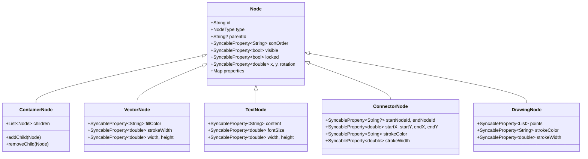

# Walkthrough: Multiplayer Canvas Data Structures

## Files Created

9 files under `lib/data/models/`:

| File | Class | Purpose |
|------|-------|---------|
| [node_type.dart](file:///Users/trungnguyenhoang/StudioProjects/multiplayer/lib/data/models/node_type.dart) | `NodeType` enum | Node types: document, page, frame, rectangle, text, vector, group, **connector**, **drawing**, **ellipse** |
| [syncable_property.dart](file:///Users/trungnguyenhoang/StudioProjects/multiplayer/lib/data/models/syncable_property.dart) | `SyncableProperty<T>` | LWW conflict resolution wrapper (timestamp + authorId) |
| [node.dart](file:///Users/trungnguyenhoang/StudioProjects/multiplayer/lib/data/models/node.dart) | `Node` (abstract) | Base class: id, type, parentId, sortOrder, position, rotation, visibility, lock |
| [container_node.dart](file:///Users/trungnguyenhoang/StudioProjects/multiplayer/lib/data/models/container_node.dart) | `ContainerNode` | Composite node with fractional-index-sorted children |
| [vector_node.dart](file:///Users/trungnguyenhoang/StudioProjects/multiplayer/lib/data/models/vector_node.dart) | `VectorNode` | Shapes: fillColor, strokeWidth, **width**, **height** |
| [text_node.dart](file:///Users/trungnguyenhoang/StudioProjects/multiplayer/lib/data/models/text_node.dart) | `TextNode` | Text: content, fontSize, **width**, **height** |
| [connector_node.dart](file:///Users/trungnguyenhoang/StudioProjects/multiplayer/lib/data/models/connector_node.dart) | `ConnectorNode` | Connectors: start/end node IDs, start/end points, stroke |
| [drawing_node.dart](file:///Users/trungnguyenhoang/StudioProjects/multiplayer/lib/data/models/drawing_node.dart) | `DrawingNode` | Freehand drawing: points list, stroke |
| [models.dart](file:///Users/trungnguyenhoang/StudioProjects/multiplayer/lib/data/models/models.dart) | — | Barrel export |

## Class Hierarchy

## Testing

**16/16 tests passed** — covering all 5 node types, LWW logic, serialization, container sorting, and property maps.
